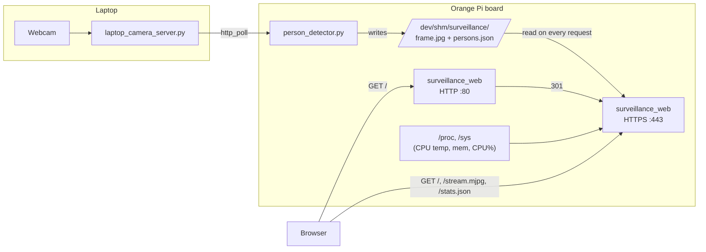

# Step 3 — Web Server, SSL, systemd (Part 1 — 25 pts)

A small multithreaded C web server: plain HTTP on port 80 (redirects
everything to HTTPS), and a TLS server on port 443 serving the live
dashboard — video stream, person count, CPU temp/memory/usage, all reading
straight from the shared files Image Processing (Step 2) writes and the
kernel's own `/proc` and `/sys` interfaces.

---

## Files

```
Web Server, SSL & systemd/
  code/
    Makefile
    server.conf                    <- have to be edited
    src/
      main.c                       <- entry point
      config.c / config.h          <- reads server.conf
      sysinfo.c / sysinfo.h        <- CPU temp / memory / CPU% straight from /proc & /sys
      persons_reader.c / .h        <- reads Image Processing's persons.json
      http_utils.c / .h            <- minimal request-line parser
      index_page.c / .h            <- generates the dashboard HTML in memory
      mjpeg_stream.c / .h          <- MJPEG multipart video streaming
      redirect_server.c / .h       <- plain HTTP :80 -> 301 to HTTPS
      https_server.c / .h          <- TLS :443, serves the dashboard + endpoints
    systemd/
      surveillance-web.service
      surveillance-imgproc.service
      surveillance-mqtt.service     <- placeholder until Step 5 builds the MQTT client
  results/
    fig/                            
```

---

## Building

On the Orange Pi (or any Debian/Ubuntu box with a C toolchain):

```bash
sudo apt update
sudo apt install build-essential libssl-dev
cd "3.Web Server, SSL & systemd/code"
make
```

This produces a `surveillance_web` binary. Quick manual smoke test before
wiring up systemd:

```bash
sudo ./surveillance_web server.conf
```

Then from another machine (or the same one):
```bash
curl -k https://<board-ip>/stats.json
curl -I http://<board-ip>/
```

`-k` skips certificate validation, since it's self-signed — that's expected
and fine for this project. Ctrl+C stops it once you've confirmed it's alive.

---

## How it fits together



**Why the systemd ordering is `imgproc` before `web`:** the web server's
`/stream.mjpg` and `/stats.json` endpoints just read whatever is currently
sitting in `/dev/shm/surveillance/`. If they start before Image Processing
has written anything there, the dashboard would just show stale/empty data
until the first frame lands — harmless, but `After=`/`Requires=` makes the
dependency explicit and means systemd won't even try starting the web
server until image processing is confirmed running. That's the rationale
to put in your report next to the flowchart above.

`surveillance-mqtt.service` depends on `imgproc` the same way (it'll
publish person counts once you build it in Step 5) — it's included now as
a placeholder so the three-service dependency graph is already complete
and consistent for the report, even though the binary doesn't exist yet.

---

## Deploying with systemd

Pick a deployment path — the unit files assume `/opt/surveillance/`:

```bash
sudo mkdir -p /opt/surveillance/web /opt/surveillance/imgproc /opt/surveillance/mqtt

# Web server
sudo cp surveillance_web server.conf /opt/surveillance/web/

# Image processing (from Step 2's folder)
sudo cp -r "../../Image Processing/code/"* /opt/surveillance/imgproc/
# (set up its venv there too, or point ExecStart at wherever you keep it —
#  see Image Processing/code/README.md)

# Install the unit files
sudo cp systemd/*.service /etc/systemd/system/
sudo systemctl daemon-reload
sudo systemctl enable --now surveillance-imgproc.service
sudo systemctl enable --now surveillance-web.service
```

(`surveillance-mqtt.service` — leave it uninstalled/disabled until Step 5
actually produces a binary for it; installing it now would just crashloop.)

Check status:
```bash
systemctl status surveillance-web.service
systemctl status surveillance-imgproc.service
journalctl -u surveillance-web.service -f
```

---

## Running the experiments

### 1-1: Boot time via `systemd-analyze blame`

```bash
sudo reboot
# after it comes back up:
systemd-analyze
systemd-analyze blame | head -20
journalctl -u surveillance-imgproc.service -u surveillance-web.service -b
```

**Screenshot:** the `systemd-analyze blame` output (make a bar chart out of
the top ~10 entries for the report) + the journalctl output for the two
critical services showing they started cleanly.

### 1-2: Kill the web server, confirm auto-restart

```bash
sudo systemctl status surveillance-web.service   # note the PID
sudo kill -9 <PID>
sleep 3
sudo systemctl status surveillance-web.service   # should show "active" again, new PID
journalctl -u surveillance-web.service -n 30
```

**Screenshot:** the journalctl output showing the `kill -9`-caused exit
followed by systemd's `Restart=on-failure` bringing it back
(look for a line like `Main process exited, code=killed, status=9/KILL`
immediately followed by a new `Started ...` line).

### 1-3: Full power cycle, unattended boot

Power the board off, power it back on, and don't touch a keyboard/mouse.

**Video needed:** the board powering on through to the dashboard being
reachable in a browser from another device, with no manual login or
command typed on the board itself.

### 1-4: HTTP → HTTPS redirect

```bash
curl -I http://<board-ip>/
```
or in a browser: open `http://<board-ip>/`, open DevTools → Network tab,
reload.

**Screenshot:** DevTools Network panel (or the curl output) showing status
`301` and a `Location: https://...` response header.

### 1-5: Certificate CN check

Open `https://<board-ip>/` in a browser, click the padlock → certificate
details / "Certificate is not valid" (expected, it's self-signed) →
Certificate Viewer.

**Screenshot:** the certificate overview panel with the **Common Name (CN)
field showing your student ID**.

### 1-6: HTML page shows student ID

Open `https://<board-ip>/`.

**Screenshot:** the rendered page — the browser tab title and the on-page
header both show your name + student ID (this comes straight from
`server.conf`, so make sure you've actually edited that file before taking
the screenshot).

---

## Config reference (`server.conf`)

| Key | Meaning |
|---|---|
| `student_name`, `student_id` | Shown in the page title/header |
| `http_port`, `https_port` | Default 80/443 (need root — see the systemd note below) |
| `cert_file`, `key_file` | Point these at the cert/key `secure_setup.sh` generated in Step 1 |
| `shared_dir`, `frame_filename`, `persons_filename` | Must match `[output]` in Image Processing's `config.ini` |
| `mjpeg_frame_interval_ms` | How often `/stream.mjpg` re-reads the frame file |
| `stats_poll_interval_ms` | How often the dashboard's JS polls `/stats.json` (assignment requires ≤2000ms) |
