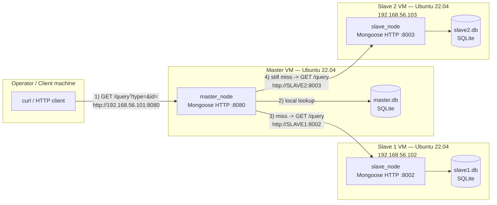

# Section 1 — Basic Design of a Distributed Database System

A minimal distributed sensor-data cluster: one **Master** node and two
**Slave** nodes, each holding its own local SQLite database, exposed over
a small HTTP API (built with the Mongoose embedded web-server library).
An operator queries the Master only; the Master transparently cascades
the lookup to the slaves if it doesn't have the answer locally.

```
Phase1/
├── master/
│   ├── src/main.cpp     # master_node — HTTP gateway + local DB + cascade to slaves
│   ├── Makefile
│   ├── env               # generated by run.sh (PORT, DB_PATH, SLAVE1_PORT, SLAVE2_PORT)
│   └── run.sh             # installs deps, configures, compiles, runs
├── slave/
│   ├── src/main.cpp      # slave_node — HTTP endpoint over its own local DB
│   ├── Makefile
│   ├── env                # generated by run.sh (PORT, DB_PATH)
│   └── run.sh              # installs deps, configures, compiles, runs (used for both slaves)
├── client_tests/
│   └── test.sh              # curl-based end-to-end regression test against the Master
├── README.md                 # this file
└── report.md                  # design write-up: DB structure, diagrams, security review
```

> **Note on the proposed layout:** this repository uses `client_tests/test.sh`
> as the combined `scripts/build_and_run.sh` + `scripts/test_requests.sh`
> equivalent — `run.sh` inside `master/` and `slave/` already does the
> build-and-run step per node, and `client_tests/test.sh` does the
> request testing. There are no separate `master_init_db.sh` /
> `slave_init_db.sh` / `config.example` files in this bundle — see
> **"Known gaps"** in `report.md` for what that means in practice.

## Architecture / network diagram

The intended deployment is three separate Ubuntu 22.04 VMs on one
network, each with its own static/DHCP-assigned IP, talking over HTTP:



> The Master and each Slave only ever talk over IP:Port — never a shared
> filesystem or direct DB connection to another node's database. See
> **"Known gaps"** in `report.md` regarding how the Slave's IP is
> currently resolved by the Master.

## 1. How to install dependencies

Both `master/run.sh` and `slave/run.sh` install their own C/C++ toolchain
and library dependency automatically, but you need `build-essential` and
`curl` present up front (Ubuntu 22.04):

```bash
sudo apt update
sudo apt install -y build-essential curl
```

From there, each `run.sh`:
- Checks for `/usr/include/sqlite3.h` and installs `libsqlite3-dev` via
  `apt` if it's missing.
- Downloads `mongoose.c` / `mongoose.h` into `src/` from the upstream
  Mongoose repository if they aren't already present (requires internet
  access from the node the first time it's run).

So a fully clean Ubuntu 22.04 VM only needs `build-essential` and `curl`
installed manually; `libsqlite3-dev` and Mongoose are fetched by the
script itself.

## 2. How to compile the Master and Slave programs

`run.sh` compiles for you (see item 3), but you can also compile
manually once `src/mongoose.c` / `src/mongoose.h` exist and
`libsqlite3-dev` is installed:

```bash
# Master
cd master
make clean && make        # produces ./master_node

# Slave (run the same way on each slave checkout)
cd slave
make clean && make        # produces ./slave_node
```

## 3. How to run the Master and Slave programs

All configuration (bind port, DB path, and — on the Master — the
slaves' ports) is supplied via **environment variables**, never
hardcoded. `run.sh` prompts for these interactively and writes them to
an `env` file for the record; nothing about the network topology is
compiled into the binary.

Start the two slaves first, then the Master (the Master needs the
slaves reachable for its cascade to succeed on a local miss):

```bash
# On Slave 1's VM
cd slave
./run.sh
# Enter Binding Port for this Slave [8080]: 8002
# Enter local SQLite database path [../slave1.db]: ../slave1.db

# On Slave 2's VM
cd slave
./run.sh
# Enter Binding Port for this Slave [8080]: 8003
# Enter local SQLite database path [../slave1.db]: ../slave2.db

# On the Master's VM
cd master
./run.sh
# Enter Gateway Binding Port for Master [8080]: 8080
# Enter target Master SQLite DB path [../master.db]: ../master.db
# Enter Target Slave 1 Communication Port [8002]: 8002
# Enter Target Slave 2 Communication Port [8003]: 8003
```

Each program runs in the foreground and logs every request/cascade step
to stdout; `Ctrl+C` sends `SIGINT`, which is caught and shuts the
process down cleanly.

Equivalently, without the prompts, you can export the variables
yourself and run the compiled binary directly:

```bash
PORT=8002 DB_PATH=../slave1.db ./slave_node
PORT=8003 DB_PATH=../slave2.db ./slave_node
PORT=8080 DB_PATH=../master.db SLAVE1_PORT=8002 SLAVE2_PORT=8003 ./master_node
```

## 4. How to send a request to the Master

Send every request to the **Master only** — never directly to a slave —
using `GET /query?type=<sensor_type>&id=<sensor_id>`:

```bash
curl "http://192.168.56.101:8080/query?type=temperature&id=101"
# -> 24.8               (found locally on the Master)

curl "http://192.168.56.101:8080/query?type=temperature&id=204"
# -> NOT_FOUND on Master and Slave 1, then found on Slave 2's cascade,
#    returned by the Master

curl "http://192.168.56.101:8080/query?type=temperature&id=999"
# -> NOT_FOUND           (missing from Master, Slave 1, and Slave 2)
```

`client_tests/test.sh` automates a batch of these checks end-to-end
against a running cluster:

```bash
cd client_tests
./test.sh
# Enter Master Node IP [192.168.56.101]:
# Enter Master Node Port [8001]:
```

See `report.md` for the full request/response cascade path, the
database structure behind these lookups, and a review of this HTTP
interface's security posture.
