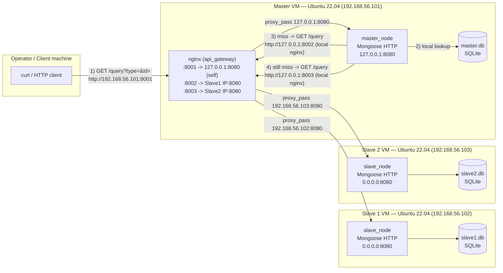

# Section 1 — Basic Design of a Distributed Database System

A minimal distributed sensor-data cluster: one **Master** node and two
**Slave** nodes, each holding its own local SQLite database, exposed over
a small HTTP API (built with the Mongoose embedded web-server library).
An operator queries the Master only; the Master transparently cascades
the lookup to the slaves if it doesn't have the answer locally. An
**NGINX** reverse proxy running on the Master node is what actually lets
the operator (and the Master's own cascade code) reach all three nodes
through one IP and three fixed ports — see **"NGINX port-based
addressing"** below; this is the Section 1 optional advanced challenge,
and `master/run.sh` now sets NGINX up for you automatically.

```
Phase1/
├── master/
│   ├── src/main.cpp     # master_node — HTTP gateway + local DB + cascade to slaves
│   ├── Makefile
│   ├── env               # generated by run.sh (PORT, DB_PATH, SLAVE1_IP, SLAVE1_PORT, SLAVE2_IP, SLAVE2_PORT)
│   └── run.sh             # installs deps, configures + reloads NGINX, compiles, runs
├── slave/
│   ├── src/main.cpp      # slave_node — HTTP endpoint over its own local DB
│   ├── Makefile
│   ├── env                # generated by run.sh (PORT, DB_PATH)
│   └── run.sh              # installs deps, configures, compiles, runs (used for both slaves)
├── client_tests/
│   └── test.sh              # curl-based end-to-end regression test against the Master
├── figure/                   # screenshots + the NGINX concept diagram
├── README.md                  # this file
└── Report.md                   # design write-up: DB structure, diagrams, security review
```

> **Note on the proposed layout:** this repository uses `client_tests/test.sh`
> as the combined `scripts/build_and_run.sh` + `scripts/test_requests.sh`
> equivalent — `run.sh` inside `master/` and `slave/` already does the
> build-and-run step per node, and `client_tests/test.sh` does the
> request testing. There are no separate `master_init_db.sh` /
> `slave_init_db.sh` / `config.example` files in this bundle — see
> **"Known gaps"** in `Report.md` for what that means in practice.

## ⚠️ Before you run this: a config mismatch to know about

`master/run.sh` now asks for each slave's **real IP and real port** and
uses them to write a correct NGINX config — that part works. But it then
also saves that same raw slave port into `env` as `SLAVE1_PORT`/
`SLAVE2_PORT`, which is what `master_node` itself dials on
**its own loopback** (`127.0.0.1:<SLAVE1_PORT>`). Those need to be
NGINX's fixed local ports, `8002`/`8003` — not the slave's own bind port
(typically `8080` on both slaves, same as the Master's own gateway
port). Left as the script currently writes it, `master_node`'s cascade
will try to dial `127.0.0.1:8080` for *both* slaves, which is the
Master's own gateway, not NGINX's slave routes — see **"Known gaps"** in
`Report.md` for the full explanation and the one-line fix. Until that's
patched, after running `master/run.sh` once, open `master/env` and
correct it by hand before starting `master_node`:

```bash
# in master/env, after running master/run.sh:
SLAVE1_PORT=8002   # NGINX's fixed local route to Slave 1, not Slave 1's own port
SLAVE2_PORT=8003   # NGINX's fixed local route to Slave 2, not Slave 2's own port
```
then re-export and re-run `./master_node` (or just re-run `master/run.sh`
and enter `8002`/`8003` when it re-prompts — the NGINX config it
generates from your slave IP/port answers stays correct either way,
since that part uses `S1_IP`/`S1_PORT` directly, independent of what
ends up in `env`).

## Architecture / network diagram

Every node — Master, Slave 1, Slave 2 — runs the **same kind of thing**:
its own `master_node`/`slave_node` binary, bound only to its own
loopback interface on port `8080`, backed by its own local SQLite DB.
None of the three binaries are ever reachable directly from the network.
**NGINX**, installed only on the Master VM, is the one process with a
network-facing listener; it terminates the operator's request and
reverse-proxies it either to the Master's own local `:8080` or across
the network to whichever slave the Master's cascade needs next:



The payoff: `master_node`'s own cascade code (`fetch_from_slave()`)
never needs to know a slave's real IP — it always dials
`127.0.0.1:<SLAVE1_PORT|SLAVE2_PORT>` on its own machine, and NGINX (the
only thing on the Master VM that's actually configured with the slaves'
real network addresses) does the routing — *once `SLAVE1_PORT`/
`SLAVE2_PORT` actually hold NGINX's `8002`/`8003`, per the warning
above.* This is what the Section 1 spec's optional advanced challenge
describes: *"the Master can use different Ports instead of different
IPs to manage the nodes via a shared IP."*

## NGINX port-based addressing (Section 1 advanced challenge)

**Concept:** see `figure/Embeded_4_1.png` for the full diagram. Each
node's API always listens on the same local port, `8080`. NGINX, running
only on the Master VM, exposes three distinct ports on the Master's one
public IP — `8001`, `8002`, `8003` — one per node:

| NGINX listen port (on Master's IP) | Proxies to | Used by |
|---|---|---|
| `8001` | `127.0.0.1:8080` (Master's own API) | The operator — this is the cluster's single public entry point |
| `8002` | Slave 1's real IP `:8080` | The Master's own cascade code, dialing `127.0.0.1:8002` |
| `8003` | Slave 2's real IP `:8080` | The Master's own cascade code, dialing `127.0.0.1:8003` |

**How to configure it:** `master/run.sh` now does this for you — installs
NGINX if it's missing, and writes `/etc/nginx/sites-available/api_gateway`
from the port/IP answers you give it:

```nginx
# /etc/nginx/sites-available/api_gateway  (generated by master/run.sh)

server {
    listen 8001;
    location / {
        proxy_pass http://127.0.0.1:8080;          # Master's own master_node
        proxy_set_header Host $host;
        proxy_set_header X-Real-IP $remote_addr;
        proxy_set_header X-Forwarded-For $proxy_add_x_forwarded_for;
    }
}

server {
    listen 8002;
    location / {
        proxy_pass http://192.168.56.102:8080;      # Slave 1's real IP:port, as you entered them
        proxy_set_header Host $host;
        proxy_set_header X-Real-IP $remote_addr;
        proxy_set_header X-Forwarded-For $proxy_add_x_forwarded_for;
    }
}

server {
    listen 8003;
    location / {
        proxy_pass http://192.168.56.103:8080;      # Slave 2's real IP:port, as you entered them
        proxy_set_header Host $host;
        proxy_set_header X-Real-IP $remote_addr;
        proxy_set_header X-Forwarded-For $proxy_add_x_forwarded_for;
    }
}
```

`run.sh` symlinks it into `sites-enabled`, runs `nginx -t` to validate,
and `systemctl reload nginx` — no manual NGINX steps needed at all
(**Quick note:** if NGINX isn't already installed/configured, just run
`master/run.sh` — it installs and configures NGINX itself before it
compiles or starts `master_node`).

**How to run the programs** with this scheme: `master_node` binds its
own gateway to `8080` (loopback only is enough, since NGINX is the only
thing that should reach it directly). Both slaves simply bind `8080` and
know nothing about NGINX or the Master. See **"How to run the Master and
Slave programs"** below for the exact prompts — `master/run.sh` and
`slave/run.sh` double as the advanced-challenge's compilation/execution
script too, no separate script needed (remember the port fix from the
warning above once `master/run.sh` finishes).

Slave 1 and Slave 2's `8080` still needs to be reachable from the
Master's IP over the network (a firewall rule scoped to the Master's IP
is enough — see the security review in `Report.md`); it does **not**
need to be reachable from the operator's machine at all, since the
operator only ever talks to the Master's NGINX on `8001`.

## 1. How to install dependencies

Both `master/run.sh` and `slave/run.sh` install their own C/C++ toolchain
and library dependency automatically, but you need `build-essential` and
`curl` present up front (Ubuntu 22.04):

```bash
sudo apt update
sudo apt install -y build-essential curl
```

From there, each `run.sh`:
- Checks for `/usr/include/sqlite3.h` and installs `libsqlite3-dev` via
  `apt` if it's missing.
- Downloads `mongoose.c` / `mongoose.h` into `src/` from the upstream
  Mongoose repository if they aren't already present (requires internet
  access from the node the first time it's run).
- **On the Master only**, checks for `nginx` and installs it via `apt`
  if it's missing, then writes and reloads the `api_gateway` config
  shown above.

So a fully clean Ubuntu 22.04 VM only needs `build-essential` and `curl`
installed manually; `libsqlite3-dev`, Mongoose, and (on the Master)
NGINX are all handled by the script itself.

## 2. How to compile the Master and Slave programs

`run.sh` compiles for you (see item 3), but you can also compile
manually once `src/mongoose.c` / `src/mongoose.h` exist and
`libsqlite3-dev` is installed:

```bash
# Master
cd master
make clean && make        # produces ./master_node

# Slave (run the same way on each slave checkout)
cd slave
make clean && make        # produces ./slave_node
```

## 3. How to run the Master and Slave programs

Bind port and DB path are supplied via **environment variables**, never
hardcoded; `run.sh` prompts for these interactively (plus, on the
Master, each slave's real IP and port, used only to build the NGINX
config) and writes them to an `env` file for the record.

Start the two slaves first, then the Master (which installs/reloads
NGINX itself on this same run):

```bash
# On Slave 1's VM
cd slave
./run.sh
# Enter Binding Port for this Slave [8080]: 8080
# Enter local SQLite database path [../slave1.db]: ../slave1.db

# On Slave 2's VM
cd slave
./run.sh
# Enter Binding Port for this Slave [8080]: 8080
# Enter local SQLite database path [../slave1.db]: ../slave2.db

# On the Master's VM
cd master
./run.sh
# Enter Gateway Binding Port for Master [8080]: 8080
# Enter target Master SQLite DB path [../master.db]: ../master.db
# Enter Target Slave 1 IP Address [192.168.56.102]: 192.168.56.102
# Enter Target Slave 1 Port [8080]: 8080
# Enter Target Slave 2 IP Address [192.168.56.103]: 192.168.56.103
# Enter Target Slave 2 Port [8080]: 8080
#  -> installs/configures/reloads nginx, then compiles and starts master_node
#  -> IMPORTANT: edit master/env afterwards per the warning above
#     (SLAVE1_PORT=8002, SLAVE2_PORT=8003) before this cascade will work
```

Each program runs in the foreground and logs every request/cascade step
to stdout; `Ctrl+C` sends `SIGINT`, which is caught and shuts the
process down cleanly.

Equivalently, without the prompts, you can export the variables
yourself and run the compiled binary directly:

```bash
PORT=8080 DB_PATH=../slave1.db ./slave_node
PORT=8080 DB_PATH=../slave2.db ./slave_node
PORT=8080 DB_PATH=../master.db SLAVE1_PORT=8002 SLAVE2_PORT=8003 ./master_node
```

## 4. How to send a request to the Master

Send every request to the **Master's NGINX port, `8001`** — never
directly to `master_node`'s own `8080`, and never to a slave — using
`GET /query?type=<sensor_type>&id=<sensor_id>`:

```bash
curl "http://192.168.56.101:8001/query?type=temperature&id=101"
# -> 24.8               (found locally on the Master)

curl "http://192.168.56.101:8001/query?type=temperature&id=301"
# -> NOT_FOUND on Master and Slave 1, then found on Slave 2's cascade,
#    returned by the Master

curl "http://192.168.56.101:8001/query?type=temperature&id=401"
# -> NOT_FOUND           (missing from Master, Slave 1, and Slave 2)
```

`client_tests/test.sh` automates a batch of these checks end-to-end
against a running cluster:

```bash
cd client_tests
./test.sh
# Enter Master Node IP [192.168.56.101]:
# Enter Master Node Port [8001]:
```

See `Report.md` for the full request/response cascade path, the
database structure behind these lookups, the NGINX advanced-challenge
write-up, and a review of this HTTP interface's security posture.
