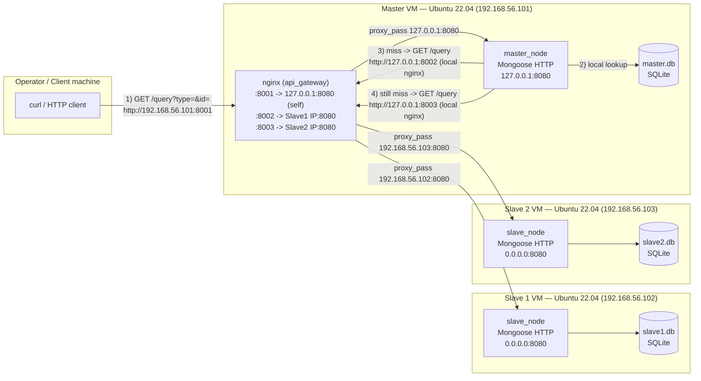
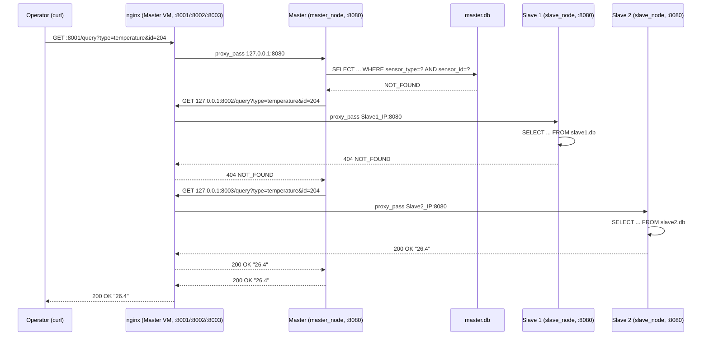
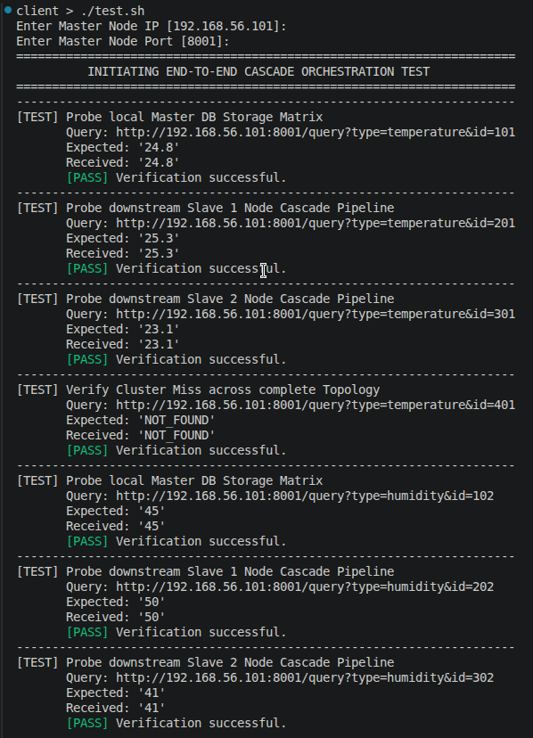
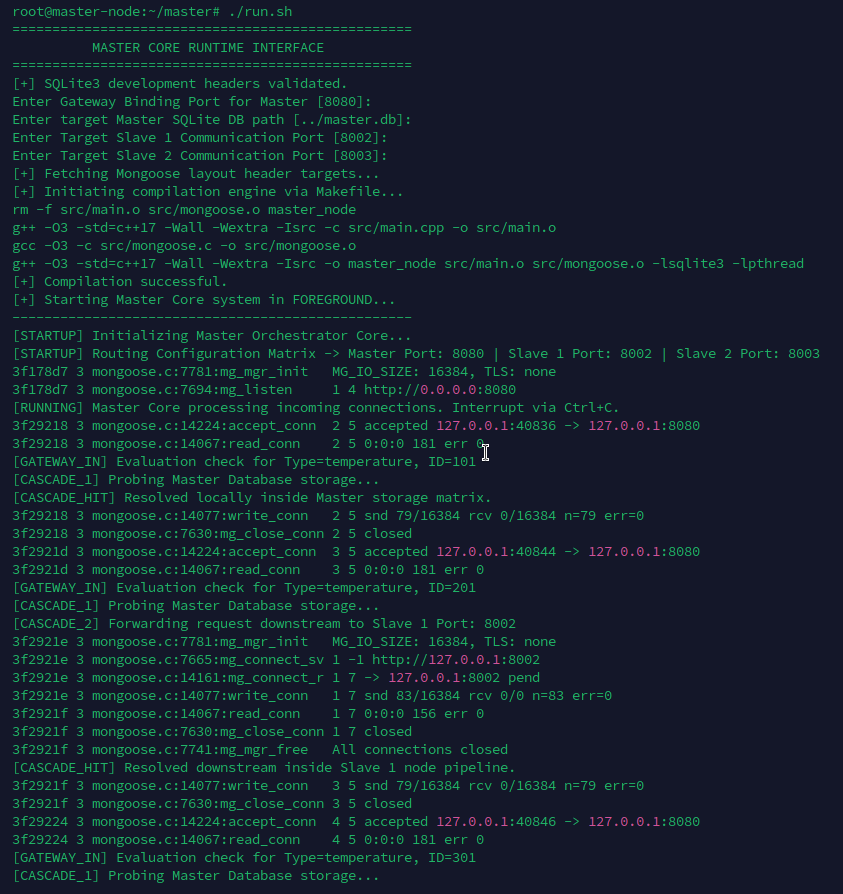
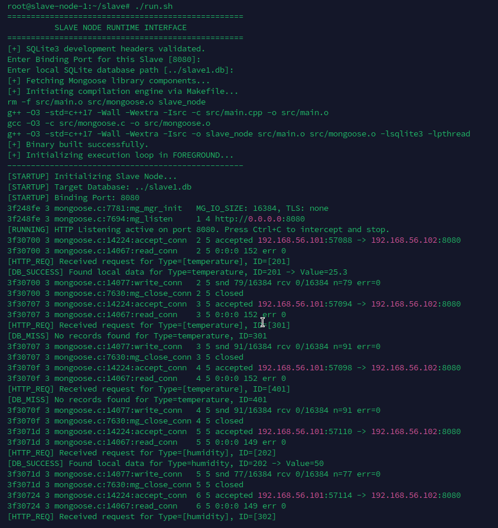
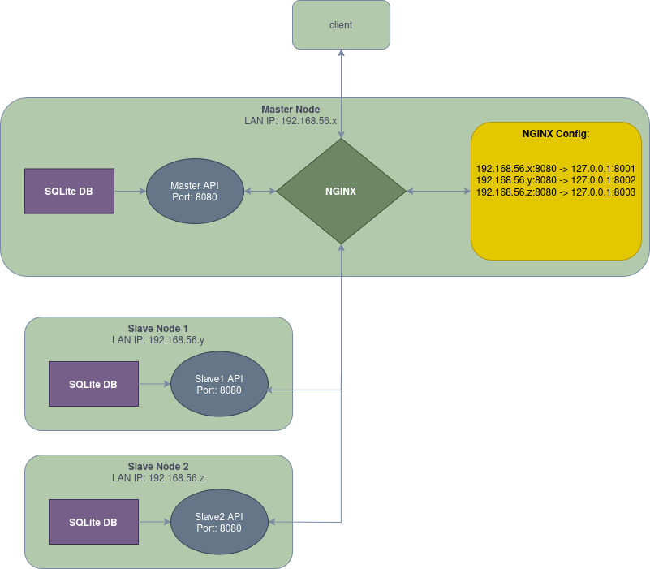

# Report — Section 1: Basic Design of a Distributed Database System

## 1. Overview

This section implements a three-node distributed sensor-data lookup
cluster: one **Master** and two **Slave** nodes, each running as its own
Ubuntu 22.04 VM with its own local SQLite database. An operator sends a
`sensor_type` + `sensor_id` lookup to the Master only; the Master
returns the answer from its own database if it has it, otherwise it
cascades the same lookup to Slave 1, then Slave 2, and relays whichever
node answers first back to the operator. Both `master_node` and
`slave_node` are built as standalone C++17 programs against the
Mongoose embedded HTTP library and SQLite3, with all port/DB
configuration supplied at runtime via environment variables — nothing
is hardcoded into the binaries. **NGINX**, installed and configured
automatically by `master/run.sh`, is what lets the whole cluster be
addressed through one IP and three fixed ports instead of three
separate IPs — this implements the section's optional advanced
challenge and is covered in full in Section 6 of this report. **Note:**
Section 8 documents a real configuration bug in the current `run.sh`
that needs a manual one-line fix before the cascade will work — read
that before deploying.

## 2. Node network diagram

Every node's own API binary is identical in shape: it binds only
`127.0.0.1:8080` (or `0.0.0.0:8080` on the slaves, since they still need
to be reachable from the Master's IP over the network) and talks only to
its own local SQLite DB. NGINX is the only network-facing listener, and
it only runs on the Master VM:



All three nodes are peers on the same subnet; only NGINX on the Master
is exposed to the operator, and only the Master initiates cascade
calls — the slaves never call each other or call back into the Master.
See `figure/Embeded_4_1.png` for the original concept diagram this is
based on.

## 3. Database structure

Each node's SQLite database holds the **same two-table schema**,
populated only with that node's own subset of sensors — the Master owns
one set of `sensor_id`s, Slave 1 owns a disjoint set, and Slave 2 owns
another disjoint set, so a given `sensor_id` exists in exactly one
node's database:

```sql
sensors (
    sensor_id    ,   -- unique key for a physical sensor, joined against sensor_readings
    sensor_type  ,   -- e.g. "temperature", "humidity", "motion", "co2", "smoke"
    sensor_name  ,   -- human-readable label, e.g. "Floor1_Room101_Temp"
    location     ,   -- where the sensor is physically installed
    unit             -- unit of the recorded value, e.g. "C", "%", "ppm"
)

sensor_readings (
    sensor_id     ,  -- foreign key -> sensors.sensor_id
    value         ,  -- the recorded reading, stored as text
    recorded_at      -- "YYYY-MM-DD HH:MM:SS", when the reading was taken
)
```

Both `master_node` and `slave_node` answer a lookup with the exact same
query, run against their own local DB:

```sql
SELECT r.value FROM sensors s
JOIN sensor_readings r ON r.sensor_id = s.sensor_id
WHERE s.sensor_type = ? AND s.sensor_id = ?
ORDER BY r.recorded_at DESC LIMIT 1;
```

i.e. "the most recent reading recorded for the sensor of this type and
ID" — a sensor can have many rows in `sensor_readings` over time
(a history), but only the newest one is ever returned by this endpoint.
Both `type` and `id` are matched together (not `id` alone) because
`sensor_id` values are only unique *within* a node, not necessarily
across the whole cluster, and pairing them with `sensor_type` avoids any
ambiguity if two different sensor kinds ever reused numbering.

Based on `client_tests/test.sh`'s expected values, the seed data used
during development follows this node ownership split:

| Node | `sensor_id` range | Sensor types observed |
|---|---|---|
| Master | 101–104 | temperature, humidity, motion |
| Slave 1 | 201–204 | temperature, humidity, motion, co2 |
| Slave 2 | 301–304 | temperature, humidity, motion, smoke |

Every query for an ID/type combination outside a node's own range
correctly falls through to `NOT_FOUND` on that node, which is what
drives the Master's cascade to the next node.

## 4. Request/response path between Master and Slaves



Step by step, as implemented in `master/src/main.cpp`:

1. The operator's request is the **only** externally-facing call; it
   always lands on the Master VM's NGINX, port `8001`, which
   reverse-proxies it to `master_node`'s `gateway_handler` on
   `127.0.0.1:8080`.
2. The Master parses `type` and `id` from the query string and rejects
   the request with `400 BAD_REQUEST` if either is missing.
3. **Cascade stage 1** — the Master queries its own `master.db`
   directly (`check_local_db`). If found, it answers immediately with
   `200` and the value; the slaves are never contacted.
4. **Cascade stage 2** — on a local miss, the Master opens a short-lived
   outbound HTTP client connection to `127.0.0.1:8002` — its own local
   NGINX (`fetch_from_slave`), which proxies the identical
   `GET /query?type=&id=` on to Slave 1's real IP over the network, and
   polls for a reply (up to ~800 ms, 16 × 50 ms poll cycles). A `200`
   response is relayed straight back to the operator.
5. **Cascade stage 3** — on a Slave 1 miss (`404`/timeout), the Master
   repeats stage 2 against its local `127.0.0.1:8003`, which NGINX
   proxies to Slave 2.
6. **Final fallback** — if neither slave has the data either, the
   Master replies `404 NOT_FOUND` to the operator itself; the slaves
   never talk to each other, and the operator never sees which node
   ultimately answered.

Each slave, independently, does only step 3's logic against its own
database — it has no awareness of the Master, NGINX, the other slave, or
the cascade; it just answers `200`+value or `404 NOT_FOUND` for whatever
it finds in its own `sensors`/`sensor_readings` tables, to whatever
client connects to its `8080` (which in practice is only ever the
Master VM's NGINX). **This entire path depends on `SLAVE1_PORT`/
`SLAVE2_PORT` actually holding `8002`/`8003` — see Section 8.**

## 5. HTTP protocol security review

The current implementation is deliberately minimal — plain HTTP,
no authentication — which is reasonable for a first design pass but has
real gaps if this were ever exposed beyond a trusted lab network:

**What it already does reasonably:**
- Every SQL query is fully parameterized (`sqlite3_bind_text`) — no
  string concatenation into SQL, so classic SQL injection via `type`/`id`
  isn't possible.
- Missing query parameters are rejected with `400` before touching the
  database.
- The Master's outbound calls to a slave have a bounded timeout
  (~800 ms) rather than blocking forever if a slave is down or
  unreachable.
- NGINX being the cluster's single network-facing listener already
  narrows the attack surface: a firewall rule on each slave restricting
  `8080` to only the Master's IP means the slaves are unreachable from
  anywhere else, including the operator's machine.

**Gaps and recommended improvements:**
- **No transport encryption.** All traffic — operator ↔ NGINX and
  Master ↔ NGINX ↔ Slave — is plaintext HTTP. Sensor IDs/types/values
  are low sensitivity here, but the same pattern would leak credentials
  or PII in a real deployment. The natural fix, since NGINX already sits
  in front of everything, is terminating TLS *there* (`listen 8001 ssl;`
  with a cert — self-signed is fine for a lab network) rather than
  modifying the Mongoose binaries; the Master↔Slave hop over `8002`/
  `8003` could similarly be upgraded to `proxy_pass https://...` once
  each slave also fronts its `8080` with a local NGINX+TLS.
- **No authentication or authorization.** Any host that can reach
  `8001` on the Master's IP can query any sensor. NGINX makes this easy
  to close in one place: an API key checked via `if ($http_x_api_key !=
  "...")` (or, better, `auth_request`) on the `8001` `server{}` block
  protects the operator-facing endpoint without touching the C++ code;
  firewalling `8002`/`8003` to the Master's IP only (as noted above)
  closes the direct-to-slave bypass.
- **No rate limiting.** A client can issue unbounded requests per
  second; each one opens a fresh SQLite connection and, on a miss, a
  fresh outbound TCP connection to each slave in turn via NGINX. NGINX's
  own `limit_req_zone`/`limit_req` directives are a natural place to add
  a per-IP cap on the `8001` listener without touching the binaries.
- **No input length bounding.** `type`/`id` are read into fixed
  128-byte buffers via `mg_http_get_var`, which is safe from overflow,
  but arbitrarily long or malformed input isn't validated further
  (e.g. no check that `id` looks numeric) before being bound into the
  query — harmless today since the query is parameterized, but worth
  validating explicitly as a defense-in-depth measure and to return a
  clearer `400` instead of a bare `NOT_FOUND`.
- **Verbose internal logging.** Every request logs the full cascade
  path (`[CASCADE_1]`, `[CASCADE_2]`, …) to stdout, which is useful for
  debugging but would need to move to a rotated log file (not stdout)
  and avoid logging raw client input unsanitized if this ran
  unattended in production.
- **HTTP/1.0 client requests.** The Master's outbound calls (through
  NGINX) to a slave are sent as `HTTP/1.0` with no keep-alive, so every
  cascade hop pays full TCP + HTTP setup cost twice (operator→NGINX and
  NGINX→slave); upgrading to persistent `HTTP/1.1` connections would
  reduce cascade latency under load, independent of the security items
  above.

## 6. Advanced challenge (optional) — NGINX port-based addressing

**Diagram of the proposed method** — see Section 2's network diagram and
`figure/Embeded_4_1.png`. Each node's API binary is identical and always
listens on its own loopback `8080`; NGINX, installed only on the Master
VM, exposes three ports on the Master's one public IP (`8001`/`8002`/
`8003`), one per node, and reverse-proxies each to that node's real
`8080` — its own for `8001`, and across the network to each slave's real
IP for `8002`/`8003`.

**How to configure the IPs and Ports:** `master/run.sh` prompts for the
Master's own port/DB path, then each slave's real IP and real port, and
writes `/etc/nginx/sites-available/api_gateway` from those answers
verbatim (see the full generated config in `README.md`); it then
symlinks it into `sites-enabled`, runs `nginx -t`, and reloads NGINX —
no manual editing needed for the NGINX side. **Separately**, `master/run.sh`
also writes `SLAVE1_PORT`/`SLAVE2_PORT` into `master/env` for
`master_node` itself to consume — as of this bundle those get the raw
slave port you typed in (e.g. `8080`) rather than NGINX's fixed `8002`/
`8003`, which breaks the cascade; see Section 8 for the exact fix.

**How to run the programs:** identical to Section 3 in the README —
`slave/run.sh` on each slave (binding its own `8080`), then
`master/run.sh` on the Master (which now also installs/configures NGINX
in the same run) — once the `env` fix from Section 8 is applied.

**Compilation and execution script:** the same `master/run.sh` and
`slave/run.sh` used throughout this section double as the advanced
challenge's build-and-run scripts, and now also as its NGINX
provisioning script — see **"How to compile"** and **"How to run"** in
`README.md`. No separate script is required.

## 7. Output figures

**Figure 1 — Client request output**



**Figure 2 — Master node output**



**Figure 3 — Slave node output**



**Figure 4 — NGINX port-based addressing concept**



## 8. Known gaps relative to the spec

Worth flagging honestly against the Section 1 requirements above, since
they weren't fully covered by the code and scripts in this bundle:

- **`master/env`'s `SLAVE1_PORT`/`SLAVE2_PORT` currently get the wrong
  value — this one stops the cascade from working.** `master/run.sh`
  prompts for "Target Slave 1 Port" / "Target Slave 2 Port" (each
  slave's own bind port, e.g. `8080`, used to build the
  `proxy_pass http://<slave-ip>:<slave-port>;` line in the NGINX
  config — that part is correct) and then also writes that exact same
  value into `env` as `SLAVE1_PORT=$S1_PORT` / `SLAVE2_PORT=$S2_PORT`.
  But `master_node`'s C++ code (`fetch_from_slave()`) uses
  `SLAVE1_PORT`/`SLAVE2_PORT` to dial its **own loopback**
  (`127.0.0.1:<port>`), expecting NGINX's fixed routing ports `8002`/
  `8003` there — not the slave's real port. With both slaves defaulting
  to `8080` (same as the Master's own gateway port), `master_node` ends
  up trying to cascade to `127.0.0.1:8080` for both slaves — its own
  gateway — instead of through NGINX's `8002`/`8003` routes. **Fix:**
  in `master/run.sh`, change
  `echo "SLAVE1_PORT=$S1_PORT" >> env` / `echo "SLAVE2_PORT=$S2_PORT" >> env`
  to hardcode NGINX's own listen ports instead —
  `echo "SLAVE1_PORT=8002" >> env` / `echo "SLAVE2_PORT=8003" >> env` —
  since those never change regardless of what real port a slave binds.
  Until that's patched, edit `master/env` by hand after running
  `master/run.sh`, per the warning at the top of `README.md`.
- **No `master_init_db.sh` / `slave_init_db.sh` / `config.example`.**
  The proposed file structure calls for a seeding script per node and
  an example config file; this bundle only includes `run.sh` (which
  writes `env` interactively) and assumes `master.db` / `slave1.db` /
  `slave2.db` already exist with the schema in Section 3 populated. Add
  a small `sqlite3 "$DB" < schema.sql` + `INSERT` seeding script per
  node to close this gap and make fresh-VM setup fully self-contained.
- **`master/README.md` and `slave/README.md`** are now short per-node
  guides (see those files) that point back here and to `README.md` for
  the full picture, rather than duplicating it.
