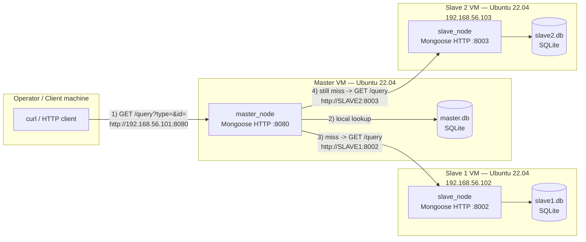
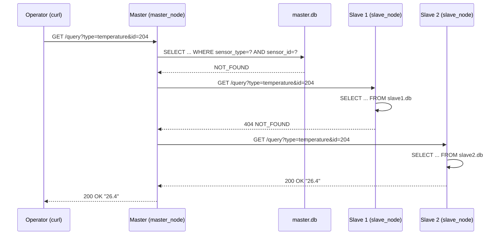

# Report — Section 1: Basic Design of a Distributed Database System

## 1. Overview

This section implements a three-node distributed sensor-data lookup
cluster: one **Master** and two **Slave** nodes, each running as its own
Ubuntu 22.04 VM with its own local SQLite database. An operator sends a
`sensor_type` + `sensor_id` lookup to the Master only; the Master
returns the answer from its own database if it has it, otherwise it
cascades the same lookup to Slave 1, then Slave 2, and relays whichever
node answers first back to the operator. Both `master_node` and
`slave_node` are built as standalone C++17 programs against the
Mongoose embedded HTTP library and SQLite3, with all IP/port/DB
configuration supplied at runtime via environment variables — nothing
is hardcoded into the binaries (see **§7** for one caveat).

## 2. Node network diagram

Target deployment: three independent Ubuntu 22.04 VMs on a single
network (e.g. a VirtualBox host-only or bridged network), each with its
own IP, reachable from the operator's machine and from each other over
plain HTTP:



All three nodes are peers on the same subnet; only the Master is
exposed to the operator, and only the Master initiates cascade calls —
the slaves never call each other or call back into the Master.

## 3. Database structure

Each node's SQLite database holds the **same two-table schema**,
populated only with that node's own subset of sensors — the Master owns
one set of `sensor_id`s, Slave 1 owns a disjoint set, and Slave 2 owns
another disjoint set, so a given `sensor_id` exists in exactly one
node's database:

```sql
sensors (
    sensor_id    ,   -- unique key for a physical sensor, joined against sensor_readings
    sensor_type  ,   -- e.g. "temperature", "humidity", "motion", "co2", "smoke"
    sensor_name  ,   -- human-readable label, e.g. "Floor1_Room101_Temp"
    location     ,   -- where the sensor is physically installed
    unit             -- unit of the recorded value, e.g. "C", "%", "ppm"
)

sensor_readings (
    sensor_id     ,  -- foreign key -> sensors.sensor_id
    value         ,  -- the recorded reading, stored as text
    recorded_at      -- "YYYY-MM-DD HH:MM:SS", when the reading was taken
)
```

Both `master_node` and `slave_node` answer a lookup with the exact same
query, run against their own local DB:

```sql
SELECT r.value FROM sensors s
JOIN sensor_readings r ON r.sensor_id = s.sensor_id
WHERE s.sensor_type = ? AND s.sensor_id = ?
ORDER BY r.recorded_at DESC LIMIT 1;
```

i.e. "the most recent reading recorded for the sensor of this type and
ID" — a sensor can have many rows in `sensor_readings` over time
(a history), but only the newest one is ever returned by this endpoint.
Both `type` and `id` are matched together (not `id` alone) because
`sensor_id` values are only unique *within* a node, not necessarily
across the whole cluster, and pairing them with `sensor_type` avoids any
ambiguity if two different sensor kinds ever reused numbering.

Based on `client_tests/test.sh`'s expected values, the seed data used
during development follows this node ownership split:

| Node | `sensor_id` range | Sensor types observed |
|---|---|---|
| Master | 101–104 | temperature, humidity, motion |
| Slave 1 | 201–204 | temperature, humidity, motion, co2 |
| Slave 2 | 301–304 | temperature, humidity, motion, smoke |

Every query for an ID/type combination outside a node's own range
correctly falls through to `NOT_FOUND` on that node, which is what
drives the Master's cascade to the next node.

## 4. Request/response path between Master and Slaves



Step by step, as implemented in `master/src/main.cpp`:

1. The operator's request is the **only** externally-facing call; it
   always lands on the Master's `gateway_handler`.
2. The Master parses `type` and `id` from the query string and rejects
   the request with `400 BAD_REQUEST` if either is missing.
3. **Cascade stage 1** — the Master queries its own `master.db`
   directly (`check_local_db`). If found, it answers immediately with
   `200` and the value; the slaves are never contacted.
4. **Cascade stage 2** — on a local miss, the Master opens a short-lived
   outbound HTTP client connection to Slave 1 (`fetch_from_slave`),
   issuing the identical `GET /query?type=&id=` request and polling for
   a reply (up to ~800 ms, 16 × 50 ms poll cycles). A `200` response is
   relayed straight back to the operator.
5. **Cascade stage 3** — on a Slave 1 miss (`404`/timeout), the Master
   repeats stage 2 against Slave 2.
6. **Final fallback** — if neither slave has the data either, the
   Master replies `404 NOT_FOUND` to the operator itself; the slaves
   never talk to each other, and the operator never sees which node
   ultimately answered.

Each slave, independently, does only step 3's logic against its own
database — it has no awareness of the Master, the other slave, or the
cascade; it just answers `200`+value or `404 NOT_FOUND` for whatever it
finds in its own `sensors`/`sensor_readings` tables.

## 5. HTTP protocol security review

The current implementation is deliberately minimal — plain HTTP,
no authentication — which is reasonable for a first design pass but has
real gaps if this were ever exposed beyond a trusted lab network:

**What it already does reasonably:**
- Every SQL query is fully parameterized (`sqlite3_bind_text`) — no
  string concatenation into SQL, so classic SQL injection via `type`/`id`
  isn't possible.
- Missing query parameters are rejected with `400` before touching the
  database.
- The Master's outbound calls to a slave have a bounded timeout
  (~800 ms) rather than blocking forever if a slave is down or
  unreachable.

**Gaps and recommended improvements:**
- **No transport encryption.** All traffic — operator ↔ Master and
  Master ↔ Slave — is plaintext HTTP. Sensor IDs/types/values are low
  sensitivity here, but the same pattern would leak credentials or PII
  in a real deployment. Mongoose supports TLS (`mg_tls_init`); the
  simplest fix is terminating TLS at each node (self-signed cert is
  fine for a lab network) or placing the whole cluster behind a
  reverse proxy/VPN that already provides it.
- **No authentication or authorization.** Any host that can reach the
  Master's port can query any sensor; any host that can reach a Slave's
  port can bypass the Master entirely and query it directly. A shared
  API key or bearer token checked on every request (both operator→Master
  and Master→Slave) would close both gaps; firewall rules restricting
  the Slave ports to only the Master's IP would help even without
  application-level auth.
- **No rate limiting.** A client can issue unbounded requests per
  second; each one opens a fresh SQLite connection and, on a miss,
  a fresh outbound TCP connection to each slave in turn. A basic
  per-IP request cap would prevent this being used to lock up the
  Master's downstream connections to the slaves.
- **No input length bounding.** `type`/`id` are read into fixed
  128-byte buffers via `mg_http_get_var`, which is safe from overflow,
  but arbitrarily long or malformed input isn't validated further
  (e.g. no check that `id` looks numeric) before being bound into the
  query — harmless today since the query is parameterized, but worth
  validating explicitly as a defense-in-depth measure and to return a
  clearer `400` instead of a bare `NOT_FOUND`.
- **Verbose internal logging.** Every request logs the full cascade
  path (`[CASCADE_1]`, `[CASCADE_2]`, …) to stdout, which is useful for
  debugging but would need to move to a rotated log file (not stdout)
  and avoid logging raw client input unsanitized if this ran
  unattended in production.
- **HTTP/1.0 client requests.** The Master's outbound calls to a slave
  are sent as `HTTP/1.0` with no keep-alive, so every cascade hop pays
  full TCP + HTTP setup cost; upgrading to persistent `HTTP/1.1`
  connections between the Master and each slave would reduce cascade
  latency under load, independent of the security items above.

## 6. Output figures

**Figure 1 — Client request output**


*Placeholder: replace with a screenshot of a terminal running
`curl "http://<master-ip>:<port>/query?type=...&id=..."` and its
returned value, or a run of `client_tests/test.sh` showing the pass/fail
summary.*

**Figure 2 — Master node output**


*Placeholder: replace with a screenshot of `master/run.sh` / `master_node`
running in a terminal, showing the `[STARTUP]`, `[GATEWAY_IN]`,
`[CASCADE_1]`/`[CASCADE_2]`/`[CASCADE_3]`, and `[CASCADE_HIT]`/
`[CASCADE_MISS]` log lines for an incoming request.*

**Figure 3 — Slave node output**


*Placeholder: replace with a screenshot of `slave/run.sh` / `slave_node`
running in a terminal, showing the `[STARTUP]`, `[HTTP_REQ]`, and
`[DB_SUCCESS]`/`[DB_MISS]` log lines for a request forwarded from the
Master.*

## 7. Known gaps relative to the spec

Worth flagging honestly against the Section 1 requirements above, since
they weren't fully covered by the code and scripts in this bundle:

- **Slave IP is hardcoded to `127.0.0.1`.** `master/src/main.cpp`'s
  `fetch_from_slave()` always connects to
  `"http://127.0.0.1:" + port` — only the *port* is configurable via
  `SLAVE1_PORT`/`SLAVE2_PORT`; the *host* is not. This works fine when
  all three programs run on one machine (or with port-forwarding), but
  it does not satisfy true multi-VM deployment with separate IPs as
  described in §2, until `SLAVE1_HOST`/`SLAVE2_HOST` environment
  variables (mirroring the existing `*_PORT` pattern) are added and
  used in place of the literal `127.0.0.1`. Notably, as it stands
  today the implementation already behaves like the **advanced
  challenge** variant — one shared IP, differentiated by port — rather
  than the base spec's separate-IP design; adding the host env vars
  would make it satisfy both.
- **No `master_init_db.sh` / `slave_init_db.sh` / `config.example`.**
  The proposed file structure calls for a seeding script per node and
  an example config file; this bundle only includes `run.sh` (which
  writes `env` interactively) and assumes `master.db` / `slave1.db` /
  `slave2.db` already exist with the schema in §3 populated. Add a
  small `sqlite3 "$DB" < schema.sql` + `INSERT` seeding script per node
  to close this gap and make fresh-VM setup fully self-contained.
- **`master/README.md` and `slave/README.md` are empty stubs** in this
  bundle — the root `README.md` and this `report.md` are the
  documentation deliverables for Section 1 as a whole.
