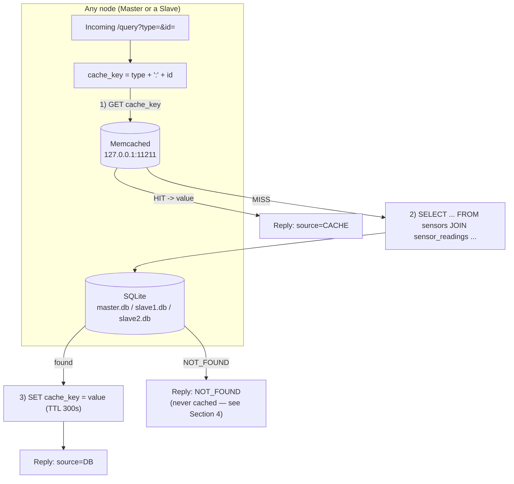
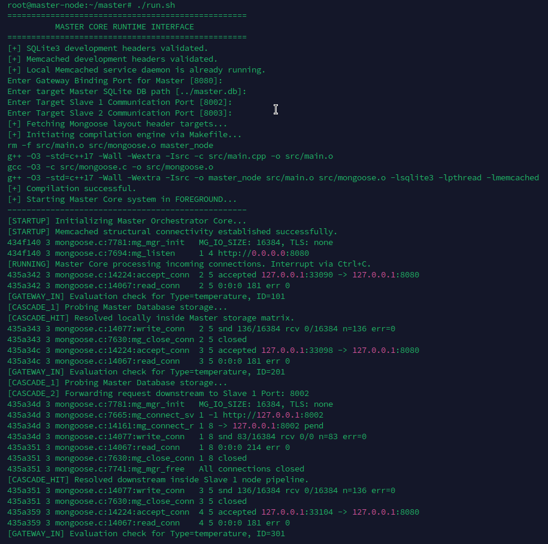
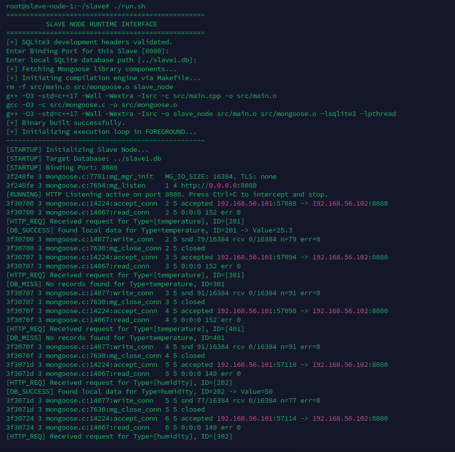
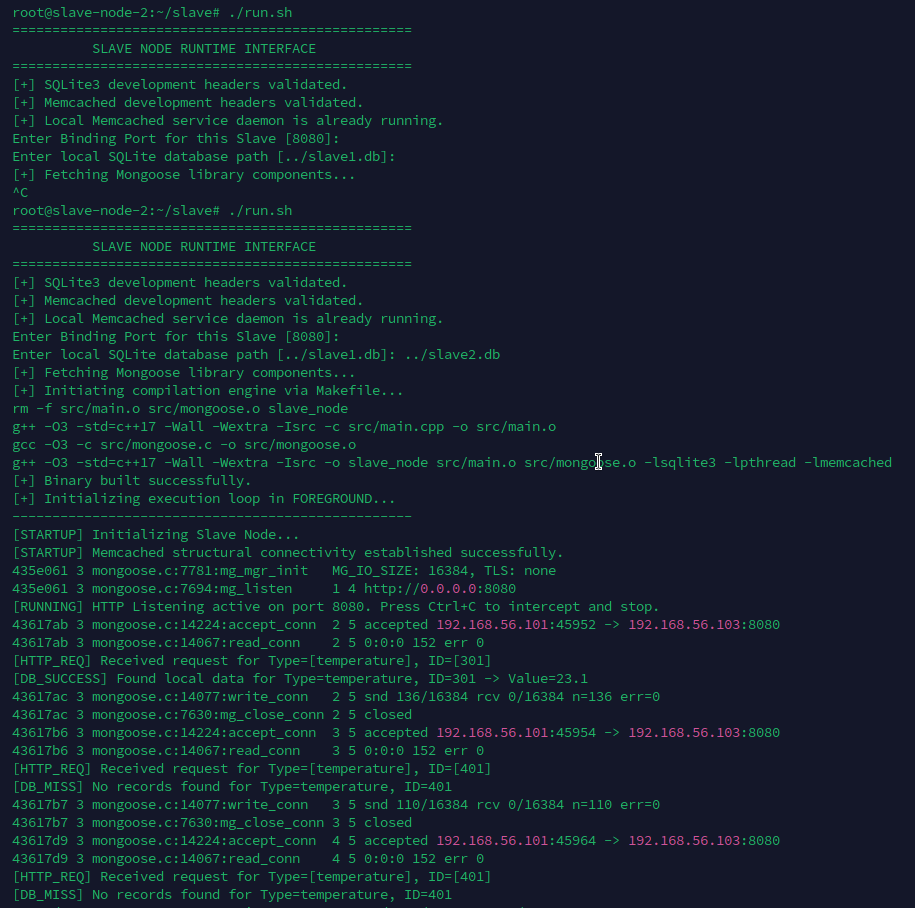
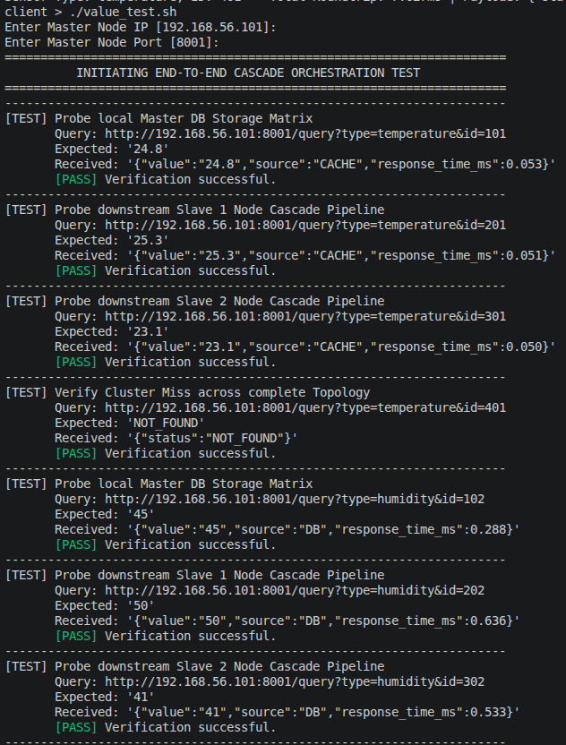
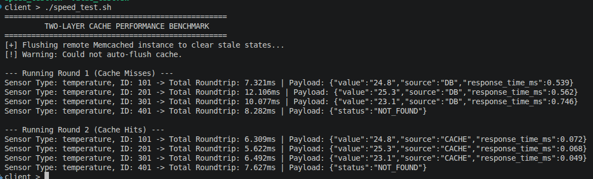

# Report — Section 2: Caching and Two-Layer Database Structure

## 1. Overview

Section 2 adds a **Memcached** cache layer in front of each node's
SQLite database from Section 1. Every node — Master, Slave 1, Slave 2 —
now runs its own local `memcached` daemon (`127.0.0.1:11211`) alongside
its `master_node`/`slave_node` binary, and every lookup is served
cache-first: SQLite is only touched on a cache miss, and that result is
written back into the cache before the response is returned. The
network topology, NGINX port-based addressing, and request cascade from
Section 1 are unchanged — see `../Phase1/Report.md` for that part; this
report covers only what's new: the two-layer read/write structure, and
the measured effect it has on response time.

## 2. Two-layer database structure

Each node's cache and database are strictly **local and independent** —
there is no shared or distributed cache across the cluster, only a
private Memcached instance per node, exactly mirroring how each node
already has its own private SQLite file:



**Read/write structure**, identical in shape on the Master and both
Slaves (`CacheManager` in each `main.cpp`):

1. **Read (cache):** `memcached_get(cache_key)` where `cache_key` is
   `"<sensor_type>:<sensor_id>"`, e.g. `"temperature:101"`. A hit
   returns the cached string immediately — SQLite is never opened for
   that request.
2. **Read (SQLite, only on a cache miss):** the same parameterized
   `SELECT r.value FROM sensors s JOIN sensor_readings r ON r.sensor_id
   = s.sensor_id WHERE s.sensor_type = ? AND s.sensor_id = ? ORDER BY
   r.recorded_at DESC LIMIT 1` query from Section 1, against that
   node's own local `.db` file.
3. **Write (cache):** on a successful SQLite read (a real value, not
   `NOT_FOUND`/`DB_ERROR`), `memcached_set(cache_key, value, 300)` — a
   **300-second TTL**, so a sensor's cached value naturally expires and
   falls back to a fresh SQLite read 5 minutes after it was last looked
   up, without any explicit invalidation logic.

**One asymmetry worth calling out on the Master specifically:** when the
Master's *own* `master.db` answers a lookup, it caches just the raw
value string (e.g. `"24.8"`) under `type:id` — identical to a Slave.
But when the Master's cascade has to fall through to a Slave, it caches
the **Slave's entire raw JSON response body**
(`{"value":"...","source":"DB","response_time_ms":...}`) under that same
key, because that's the literal string `fetch_from_slave()` returns.
The Master's cache-hit path (`gateway_handler`, before Stage 1) handles
both shapes: it looks for a `"value":"..."` substring in whatever it
read from the cache and extracts it if present, otherwise uses the
cached string as-is. Functionally this still returns the right value
either way, but it means the Master's cache literally stores two
different formats depending on whether the cached entry originated
locally or via cascade — worth normalizing to "always cache just the
raw value" in a future revision for consistency (see Section 5).

## 3. Master and Slave program output

Both programs now respond with a small JSON object instead of a bare
value, giving the last recorded value **and** how long the lookup took
inside that node:

```json
{"value":"24.8","source":"DB","response_time_ms":2.417}
{"value":"24.8","source":"CACHE","response_time_ms":0.083}
{"status":"NOT_FOUND"}
```

`response_time_ms` is measured with `std::chrono::high_resolution_clock`
from the moment the HTTP handler starts processing the request to the
moment it's about to reply — i.e. cache/DB lookup time, not including
the client's network round-trip. On the Master, this is only fully
accurate for a **cache hit** or a **local DB hit**; when the Master
relays a Slave's response verbatim (Stage 2/3 of the cascade), the
`response_time_ms` in the JSON that reaches the operator is the
**Slave's** internally-measured time, not the Master's own elapsed time
including the network hop to the Slave — see Section 5.

## 4. Speed test script — design and analysis

`client_tests/speed_test.sh` queries the same four sensors twice in a
row against the Master and prints the wall-clock round-trip time (via
`date +%s%N`, i.e. measured entirely from the operator's side, including
network latency) for each request:

**How the cache is initialized:** each node's `main()` calls
`g_cache.init("127.0.0.1", 11211)` once at startup, before it starts
listening for HTTP requests — this only opens a `memcached_st` client
handle, it doesn't pre-populate any keys. The cache starts **empty**;
the first request for any given sensor is always a miss until something
writes to that key.

**At what time data is read from the cache:** on every single request,
*first* — before SQLite is touched at all (see the flowchart in Section 2).

**At what time data is read from SQLite:** only when the cache lookup
for that exact `type:id` key returns nothing (a miss) — either because
it was never queried before, its 300-second TTL expired, or (Master
only) `speed_test.sh` explicitly flushed the cache beforehand.

**Round 1 (cache misses):** `speed_test.sh` sends `flush_all` to
`127.0.0.1:11211` right before Round 1 to guarantee a clean slate, so
every Round 1 query is a genuine cache miss — each one pays for opening
`master.db`/`slave*.db`, running the parameterized `SELECT`, and (for
sensors not on the Master) the Master↔NGINX↔Slave network hop on top.

**Round 2 (should be cache hits) — and the one case where it isn't:**
Round 2 re-sends the identical four queries. All entries that returned
a real value in Round 1 are now served straight from the Master's own
Memcached (`source":"CACHE"`), regardless of whether that sensor
actually lives on the Master or was originally resolved via a Slave —
because the Master's cache-check happens *before* it even looks at its
own `master.db`, a value that was cached in Round 1 (however it was
originally obtained) short-circuits the entire cascade on Round 2. The
one exception is the test's `temperature:401` case, deliberately chosen
to not exist on any node: **a `NOT_FOUND` result is never written to
the cache** (`g_cache.set()` is only called on the success paths in both
`main.cpp` files — see Section 2's flowchart), so a query for a nonexistent
sensor stays `source":"DB"` — really, a full miss-cascade to
`NOT_FOUND` — on every round, with no cache involved at all. This is
the correct, spec-anticipated answer to *"if data is not read from the
cache in the second round, what is the reason"*: it's not read from
the cache because negative results are intentionally never cached.

**Reading times and comparison:** see **Figure 5**
(`figure/client_speed_test.png`) for the actual captured Round 1 vs.
Round 2 numbers from a real run — this report doesn't restate exact
milliseconds here since those depend on the machine/VM the screenshot
was taken on. Qualitatively, expect Round 1 entries to run at
low-single-digit-to-tens of milliseconds (SQLite file open + prepared
statement + query, plus a full NGINX-proxied network round-trip for any
sensor that isn't local to the Master), and Round 2 entries — apart
from `temperature:401` — to drop to sub-millisecond
`response_time_ms` values, since a local Memcached `GET` is just an
in-memory hash lookup over a loopback socket with no disk I/O, no query
planning, and (critically) no cascade to a Slave at all. The `401` case
is the useful control: its timing should stay roughly flat between
Round 1 and Round 2, which is the visible confirmation that it's really
the caching (and not just "the second request is always faster")
driving the improvement on the other three.

**Correctness under caching:** `client_tests/value_test.sh` re-runs
Section 1's full correctness matrix against the new JSON response
shape, confirming the cache layer changes *only* timing and `source`,
never the returned `value` — see **Figure 4**
(`figure/client_value_test.png`).

## 5. Known gaps relative to the spec

- **`temperature:401` never gets faster — by design, not a bug**, but
  worth stating explicitly in any results write-up per Section 4 above, since
  it's the one line in `speed_test.sh`'s output that won't show a
  Round 1 → Round 2 improvement.
- **`speed_test.sh`'s `flush_all` targets `127.0.0.1:11211`**, i.e.
  whichever machine actually runs the script — it does **not** use the
  `TARGET_IP` the operator typed in for the Master's address. Running
  the script from the Master VM itself (as `README.md` recommends) is
  correct; running it from the operator's own laptop flushes a local
  Memcached there (if one is even installed) instead of the Master's,
  which would silently break the "Round 1 is guaranteed cold" guarantee
  the script is built around.
- **Master's cache stores two different value shapes** (raw value vs. a
  Slave's full JSON body) under the same key format, as described in
  Section 2 — functionally correct today because of the compensating
  substring-extraction on the read path, but fragile if that read path
  is ever changed without also updating the write path, or vice versa.
- **Cascaded responses report the Slave's timing, not the Master's.**
  As noted in Section 3, `response_time_ms` for a Stage 2/3 cascade hit is
  whatever the Slave measured internally, not the Master's own elapsed
  time (which would include the Master↔NGINX↔Slave round-trip). A
  reader comparing `response_time_ms` values across different `source`
  values for cascaded vs. local results should keep this in mind.
- **`run.sh`'s automatic Memcached detection has a typo.** Both
  `master/run.sh` and `slave/run.sh` check
  `command -v memcached &> /dev/brk` (should be `/dev/null`) before
  deciding whether to install `memcached`/`libmemcached-dev`. Because
  `/dev/brk` doesn't exist, that redirection itself fails, so the
  `command -v` check's exit status is effectively always non-zero —
  in practice this just means `run.sh` always re-runs
  `apt install -y memcached libmemcached-dev` (harmless — `apt` no-ops
  if they're already the newest version — but not the "skip if already
  installed" fast path the check was meant to provide).
- **This section's `master/run.sh` still expects NGINX configured
  manually.** `../Phase1/master/run.sh` has since been extended to
  install and configure NGINX automatically (see
  `../Phase1/Report.md` Section 6), but that change wasn't carried
  over into this section's `master/run.sh`, which still just prompts
  for `SLAVE1_PORT`/`SLAVE2_PORT` directly (expected to already be
  NGINX's fixed `8002`/`8003`) without touching NGINX itself. Set up
  NGINX per `../Phase1/README.md` first if you're starting a cluster
  fresh for this section.

## 6. Output figures

**Figure 1 — Master node output**



**Figure 2 — Slave 1 node output**



**Figure 3 — Slave 2 node output**



**Figure 4 — Client correctness test output**



**Figure 5 — Client speed test output**



> As we can see from the above speed test result the parameter `response_time_ms` has been decreased as we read the value from the cache, but the parameter `Total Roundtrip` has not been changed due to being so greater than `response_time_ms` and this change does not seem too much for it.