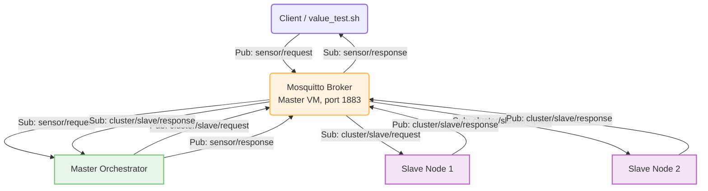

# Section 3 — System Connection to the MQTT Protocol

Same sensor cluster as Sections 1–2 (Master + 2 Slaves, each with its
own SQLite DB and Memcached cache), now reachable **over MQTT instead of
HTTP**. There is no more HTTP gateway or NGINX in this section — every
node is now a plain MQTT client of a single Mosquitto broker running on
the Master VM, and the "operator" is anyone publishing/subscribing to
the right topics on that broker (in practice, `client_tests/value_test.sh`,
or `mosquitto_pub`/`mosquitto_sub` by hand).

```
Phase3/
├── master/
│   ├── src/main.cpp     # master_node — MQTT client: answers sensor/request, fans out to slaves, replies on sensor/response
│   ├── Makefile
│   ├── env               # generated by run.sh (DB_PATH, MQTT_BROKER)
│   └── run.sh             # installs deps incl. Mosquitto, configures + starts the broker, compiles, runs
├── slave/
│   ├── src/main.cpp      # slave_node — MQTT client: answers cluster/slave/request over its own local DB
│   ├── Makefile
│   ├── env                # generated by run.sh (DB_PATH, MQTT_BROKER)
│   └── run.sh              # installs deps, compiles, runs (used for both slaves)
├── client_tests/
│   └── value_test.sh        # mosquitto_pub/sub-based two-round correctness + response-time test
├── latex/fig/                # screenshots + the MQTT topic/communication diagram
├── README.md                  # this file
└── Report.md                   # MQTT version/QoS rationale, topic design, communication diagrams
```

> **Note on the proposed layout:** `master/run.sh` and `slave/run.sh`
> together cover "Codes related to the MQTT connection", "the Makefile",
> and "Compilation and execution script" from the Section 3 deliverables
> list; `master/run.sh`'s Mosquitto install/config block is "the MQTT
> configuration file" deliverable (it writes
> `/etc/mosquitto/conf.d/local.conf` itself — see item 2 below);
> `client_tests/value_test.sh` is "the MQTT test script".

## 1. How to install the Broker

Mosquitto only needs to run on **one place** — the Master VM, since
every node (Master and both Slaves) connects out to it as a client.
`master/run.sh` installs it automatically alongside the other
dependencies (`libsqlite3-dev`, `memcached`, `libmemcached-dev`,
`libpaho-mqtt-dev`, `mosquitto`) via `apt`, checking `dpkg -s <package>`
for each first. To do it by hand on Ubuntu 22.04:

```bash
sudo apt update
sudo apt install -y mosquitto libpaho-mqtt-dev
```

`mosquitto` is the broker daemon itself; `libpaho-mqtt-dev` provides the
Eclipse Paho C client library (`-lpaho-mqtt3c`) that `master_node`/
`slave_node` are compiled against. Client-side tools for testing
(`mosquitto_pub`/`mosquitto_sub`) come from a separate package,
`mosquitto-clients` — `client_tests/value_test.sh` installs this itself
if it's missing (see item 7).

## 2. How to configure MQTT

`master/run.sh` writes `/etc/mosquitto/conf.d/local.conf` itself (if it
doesn't already contain the right `listener` line) and restarts the
broker:

```
# /etc/mosquitto/conf.d/local.conf  (written by master/run.sh)
listener 1883 0.0.0.0
allow_anonymous true
```

This makes the broker listen on all interfaces (not just loopback), so
both slaves and any test client can reach it over the network at the
Master's IP, port `1883` — Mosquitto's default port, and the default
`tcp://` scheme both `master/src/main.cpp` and `slave/src/main.cpp`
expect. `allow_anonymous true` means no username/password is required
to connect — see `Report.md` for what that means for security, and
consider tightening it (`password_file`, TLS on `8883`) before using
this outside a lab network.

Each program takes its **broker endpoint** via the `MQTT_BROKER`
environment variable (default `tcp://127.0.0.1:1883` on the Master,
since it's local; `run.sh` prompts for it explicitly on each slave,
defaulting to the Master's LAN IP) — never hardcoded.

## 3. The structure of the Topics

Four flat topics, no wildcards, carrying small JSON payloads tied
together by a `correlation_id` field (since plain MQTT pub/sub has no
built-in request/response pairing — anyone subscribed to a topic gets
every message on it):

| Topic | Published by | Subscribed by | Payload |
|---|---|---|---|
| `sensor/request` | Client (e.g. `value_test.sh`) | Master | `{"type":"...","id":"...","correlation_id":"..."}` |
| `cluster/slave/request` | Master (broadcast, one publish) | **Both** Slave 1 and Slave 2 | same shape as above |
| `cluster/slave/response` | Whichever slave answers (each independently) | Master | `{"value":"...","source":"CACHE"\|"DB","response_time_ms":...,"correlation_id":"..."}` or `{"status":"NOT_FOUND","correlation_id":"..."}` |
| `sensor/response` | Master | Client | same shape as a slave's response, or the Master's own `{"value":...}`/`{"status":"NOT_FOUND"}`, always with `correlation_id` appended |



Because a topic broadcasts to *every* subscriber, `cluster/slave/request`
reaches **both** slaves simultaneously — a request is never sent to
"Slave 1, then Slave 2" like Sections 1–2's HTTP cascade; both check
their own cache/DB in parallel, and the Master's `correlation_id`
bookkeeping (see `Report.md`) takes whichever one answers first with a
real value, or waits for both to report `NOT_FOUND` before giving up.

## 4. How to run the programs

Start both slaves first (each connects out to the Master's broker), then
the Master (which installs and configures Mosquitto itself before it
compiles or starts):

```bash
# On the Master's VM
cd master
./run.sh
# Enter target Master SQLite DB path [../master.db]: ../master.db
# Enter MQTT Broker Endpoint [tcp://127.0.0.1:1883]: tcp://127.0.0.1:1883
#  -> installs mosquitto + memcached + libpaho-mqtt-dev if missing,
#     configures & restarts mosquitto, then compiles and starts master_node

# On Slave 1's VM
cd slave
./run.sh
# Enter local SQLite database path [../slave1.db]: ../slave1.db
# Enter Target MQTT Broker Endpoint [tcp://192.168.56.101:1883]: tcp://192.168.56.101:1883

# On Slave 2's VM
cd slave
./run.sh
# Enter local SQLite database path [../slave1.db]: ../slave2.db
# Enter Target MQTT Broker Endpoint [tcp://192.168.56.101:1883]: tcp://192.168.56.101:1883
```

Each program logs its MQTT subscriptions once connected
(`[MQTT] Core Subscriptions Active.` on the Master,
`[RUNNING] Subscribed to topic 'cluster/slave/request'.` on a slave) and
runs in the foreground; `Ctrl+C`/`SIGTERM` are caught for a clean
shutdown (`MQTTClient_disconnect`).

Equivalently, without the prompts:

```bash
DB_PATH=../slave1.db MQTT_BROKER=tcp://192.168.56.101:1883 ./slave_node
DB_PATH=../slave2.db MQTT_BROKER=tcp://192.168.56.101:1883 ./slave_node
DB_PATH=../master.db MQTT_BROKER=tcp://127.0.0.1:1883      ./master_node
```

## 5. How to send requests using `mosquitto_pub`

Publish a JSON request to `sensor/request` with a `type`, `id`, and a
`correlation_id` you choose (used to match the reply — see item 6):

```bash
mosquitto_pub -h 192.168.56.101 -t "sensor/request" \
  -m '{"type":"temperature","id":"101","correlation_id":"manual-test-1"}'
```

## 6. How to receive responses using `mosquitto_sub`

Subscribe to `sensor/response` **before** publishing the request (or in
a second terminal), then filter for your `correlation_id`:

```bash
mosquitto_sub -h 192.168.56.101 -t "sensor/response"
# {"value":"24.8","source":"DB","response_time_ms":2.417,"correlation_id":"manual-test-1"}
```

`-C 1` (receive exactly one message then exit) and `-W <seconds>`
(timeout) are useful for scripting a single request/response pair, as
`client_tests/value_test.sh` does — see item 7.

## 7. How to run the test script

```bash
cd client_tests
./value_test.sh
# Enter MQTT Broker Host IP [192.168.56.101]:
```

It installs `mosquitto-clients` if missing, flushes the Master's
Memcached (`flush_all` sent to `<broker-ip>:11211`) so Round 1 starts
cold, then queries four sensors — one on the Master, one on each slave,
and one that doesn't exist anywhere — **twice**, publishing to
`sensor/request` and waiting on a one-shot `mosquitto_sub` subscription
to `sensor/response` for each, printing the wall-clock round-trip time
and a pass/fail check against the expected value for every query in
both rounds.

## 8. Comparison of response times

Round 1 (post-flush) pays for Mosquitto pub/sub round-trips plus, for
the two non-Master sensors, the Master↔broker↔slave fan-out and a
SQLite read; Round 2 repeats the same four queries and should resolve
straight from the Master's Memcached for the three sensors that exist,
skipping SQLite and the slave fan-out entirely — mirroring Section 2's
cache-hit speedup, now measured end-to-end over MQTT instead of HTTP.
The one sensor that doesn't exist anywhere stays equally slow in both
rounds, since `NOT_FOUND` results are never cached (same as Section 2).
See `Report.md` Section 5 for the full analysis and the actual captured
numbers in `latex/fig/client_value_output.png`.
