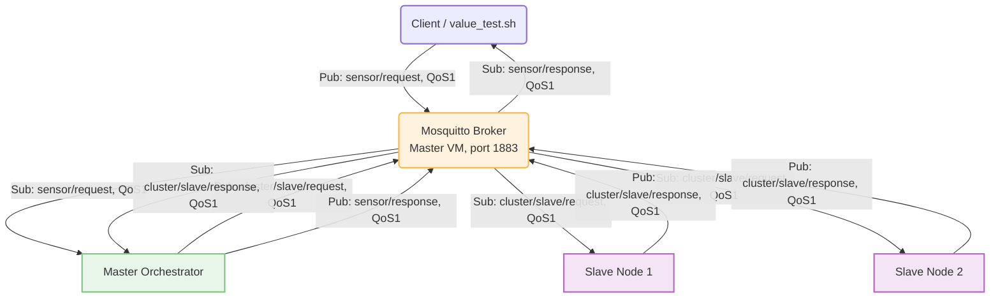
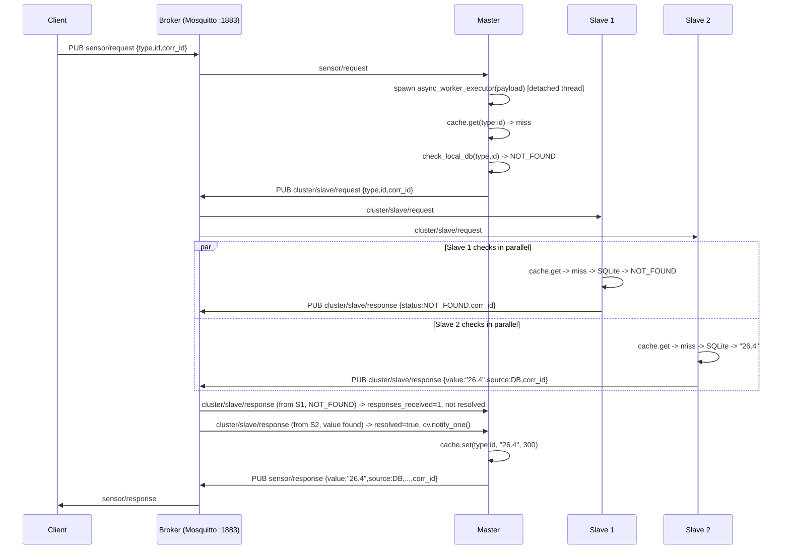
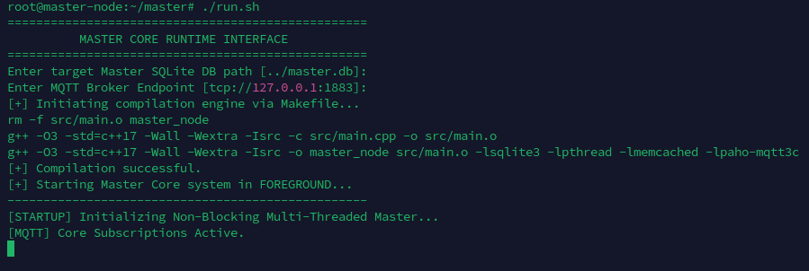
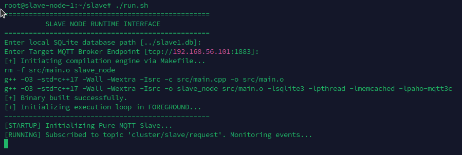
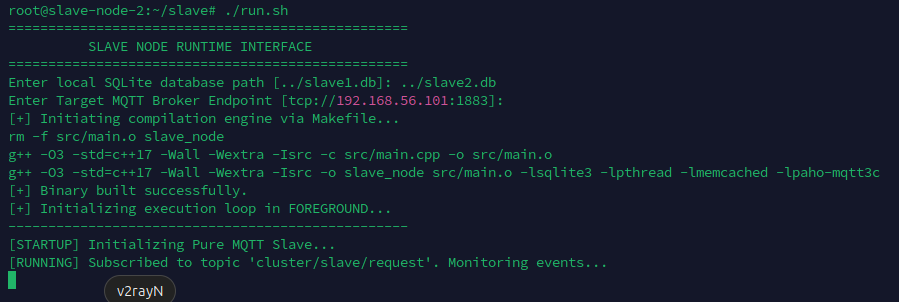
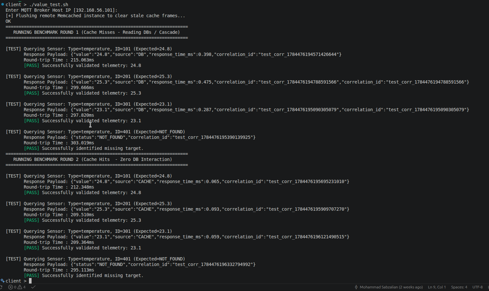

# Report — Section 3: System Connection to the MQTT Protocol

## 1. Overview

Section 3 replaces Sections 1–2's HTTP/NGINX transport entirely with
**MQTT**: every node — Master and both Slaves — is now a plain MQTT
client of one Mosquitto broker running on the Master VM, talking over
four fixed topics instead of `GET /query` requests. The underlying
per-node storage is unchanged from Section 2 (local SQLite +
per-node Memcached cache); only how a query reaches a node, and how the
answer comes back, has moved from HTTP/NGINX to publish/subscribe.

**MQTT version:** 3.1.1 — both `master/src/main.cpp` and
`slave/src/main.cpp` set `conn_opts.MQTTVersion = MQTTVERSION_3_1_1`
explicitly via the Eclipse Paho C client (`libpaho-mqtt3c`).

**QoS level:** **QoS 1 ("at least once")**, used uniformly for every
publish and every subscription in this bundle
(`pubmsg.qos = 1` on all four topics; `MQTTClient_subscribe(..., 1)` on
every subscribe call). Rationale:
- **QoS 0 ("at most once")** would risk a request or response silently
  vanishing on a dropped packet with no retry — unacceptable for a
  query/response protocol where the client is actively waiting on a
  single reply.
- **QoS 2 ("exactly once")** adds a 4-part handshake
  (`PUBLISH`→`PUBREC`→`PUBREL`→`PUBCOMP`) to guarantee no duplicate
  delivery — unnecessary overhead here, because every message in this
  system is either a read-only, idempotent sensor query or a read-only
  answer to one: a duplicate delivery of `{"value":"24.8",...}` is
  harmless (the client either reads it once via a one-shot
  `mosquitto_sub -C 1`, or the Master's `correlation_id` map simply has
  nothing left to resolve the second time — see Section 3).
- **QoS 1** is the right middle ground: guaranteed delivery (a `PUBACK`
  confirms the broker got it) without paying for exactly-once
  bookkeeping the read-only, idempotent workload doesn't need.

Both clients also connect with `cleansession = 1` — no session state or
queued messages persist across a reconnect, which is fine for
short-lived request/response traffic but is a known limitation for a
node that's briefly disconnected mid-request; see Section 6.

## 2. Topic structure

See `README.md` Section 3 for the full table; the key design decision
is a **shared, flat topic per direction** rather than a per-sensor or
per-node topic tree, with a `correlation_id` field inside every JSON
payload doing the request/response pairing that MQTT topics themselves
don't provide:

- `sensor/request` — any client → Master
- `cluster/slave/request` — Master → **both** slaves (a single publish,
  fanned out by the broker to every subscriber of that topic)
- `cluster/slave/response` — either slave → Master
- `sensor/response` — Master → the requesting client

A flat, shared topic keeps the design simple for a two-slave cluster
and matches how the Master already had no per-slave addressing need in
Section 1's advanced NGINX challenge (one shared entry point); the
trade-off is that `cluster/slave/request` reaches every slave for
*every* query, even ones a given slave will always miss — acceptable at
this scale, but worth splitting into per-slave topics
(`cluster/slave1/request`, `cluster/slave2/request`) if the cluster grew
large enough for that fan-out to matter.

## 3. Communication diagram — API, Broker, Master, Slaves

`latex/fig/Phase3.png` is the original hand-drawn version of this same
diagram.

**Full request/response cycle**, including the Master's own cache/DB
check and the fan-out-and-wait logic for a miss
(`master/src/main.cpp`'s `resolve_sensor_request()` +
`fetch_from_slaves_mqtt()`):

Two resolution paths out of `fetch_from_slaves_mqtt()`, both governed by
a `std::condition_variable` wait capped at **1500 ms**:
1. **First positive wins** — the moment *either* slave reports a real
   value, the Master resolves immediately and doesn't wait for the
   other slave's answer at all (`cv.notify_one()` fires on the first
   non-`NOT_FOUND` response).
2. **Both negative = NOT_FOUND** — if a slave reports `NOT_FOUND`, the
   Master only resolves once `responses_received >= 2`, i.e. it has
   heard from *both* slaves and neither had it.
3. **Timeout fallback** — if the 1500 ms wait expires before either
   condition is met (e.g. a slave is down and never publishes at all),
   `resolve_sensor_request()` falls through to `NOT_FOUND` anyway,
   so a single unreachable slave can't hang a query forever — at the
   cost of that query taking the full 1500 ms before giving up.

This is a genuine architectural shift from Sections 1–2's **sequential**
HTTP cascade (ask Slave 1, then only ask Slave 2 if that misses): MQTT's
broadcast-by-topic model means both slaves are asked **in parallel** on
every miss, which is both simpler (no ordered retry logic) and faster
in the worst case (a NOT_FOUND-everywhere query no longer pays for two
sequential round-trips, just one parallel one) — at the cost of every
miss doing strictly more total work across the cluster (both slaves
always do a lookup, not just however many the old cascade needed before
it found an answer).

## 4. Sending requests and receiving responses

**Sending a request** is a single `PUBLISH` to `sensor/request` with a
JSON body containing `type`, `id`, and a client-chosen `correlation_id`
(see `README.md` item 5 for the exact `mosquitto_pub` command) — QoS 1,
so the client gets a `PUBACK` from the broker confirming the message was
accepted, independent of whether the Master has answered yet.

**Receiving a response** means subscribing to `sensor/response` *before*
publishing the request (races are handled in `value_test.sh` by
starting the background `mosquitto_sub -C 1 -W 3` first, `sleep 0.2` to
let its subscription land, and only then publishing — see `README.md`
item 6/7) and filtering incoming messages for the `correlation_id` you
chose, since `sensor/response` is shared across every concurrent
requester.

## 5. Speed test analysis

`client_tests/value_test.sh` runs the same four-sensor set as Sections
1–2's tests (one on the Master, one per slave, one nonexistent) through
two full rounds, after flushing the Master's Memcached so Round 1 is a
guaranteed cold start:

- **Round 1** pays for: `PUBLISH`+`PUBACK` to `sensor/request`, the
  Master's own cache miss + local DB miss, a `PUBLISH` fan-out to both
  slaves, each slave's own cache miss + SQLite read, their
  `PUBLISH`+`PUBACK` responses back, the Master's resolution logic, and
  finally its `PUBLISH` of `sensor/response` back to the waiting
  `mosquitto_sub` — several MQTT round-trips plus SQLite I/O, for the
  three sensors that exist.
- **Round 2** repeats the identical four queries. For the three real
  sensors, the Master's *own* cache (populated during Round 1 regardless
  of whether the value was found locally or via a slave — same pattern
  as Section 2) now answers on the very first `cache.get()` inside
  `resolve_sensor_request()`, before `cluster/slave/request` is ever
  published — so Round 2 for those three collapses from "several MQTT
  hops + SQLite" down to "one MQTT round-trip (`sensor/request`/
  `sensor/response`) + an in-memory cache read", the same qualitative
  speedup Section 2 measured over plain HTTP, now visible end-to-end
  over MQTT instead.
- The fourth sensor (nonexistent, expected `NOT_FOUND`) still pays the
  **full fan-out-and-wait path** on both rounds, since a `NOT_FOUND`
  result is never written to the Master's cache
  (`resolve_sensor_request()` only calls `g_cache.set()` on the
  local-DB-hit and slave-hit branches) — this is the same
  never-cache-negatives behavior documented in
  `../Phase2/Report.md` Section 4, now also the reason this one query
  stays the slowest, and closest to the full 1500 ms timeout ceiling if
  both slaves are reachable and answering promptly (well under it in
  practice, since both slaves reply quickly — the timeout is a safety
  ceiling, not the expected path).

See `latex/fig/client_value_output.png` for the actual captured
per-query timings and pass/fail results from a real run; this report
doesn't restate exact milliseconds since those depend on the VMs the
screenshot was taken on.

## 6. Known gaps relative to the spec

- **No authentication or transport encryption on the broker.**
  `master/run.sh` configures Mosquitto with `allow_anonymous true` and a
  plaintext `listener 1883 0.0.0.0` — anyone who can reach the Master's
  IP on `1883` can publish/subscribe to any topic, including
  `cluster/slave/request`/`cluster/slave/response` directly, bypassing
  the Master entirely. A `password_file` + per-topic ACLs
  (`acl_file`), and TLS on `8883` (`mosquitto_pub/sub --cafile ...`),
  would close this — the same category of gap flagged for the HTTP
  layer in `../Phase1/Report.md` Section 5, now on the MQTT broker
  instead.
- **`cleansession = 1` means no message durability across a reconnect.**
  If a slave's MQTT connection drops for any reason mid-request, any
  `cluster/slave/request` published while it was disconnected is simply
  missed — QoS 1 guarantees delivery *while connected*, not eventual
  delivery after a reconnect. A persistent session (`cleansession =
  false` + a stable client ID) would let a reconnecting slave catch up
  on any `cluster/slave/request` it missed, at the cost of the broker
  queuing messages for offline clients.
- **The 1500 ms fallback timeout is a fixed constant** in
  `fetch_from_slaves_mqtt()`, not configurable via `env`/CLI like every
  other piece of topology/config in this project — worth promoting to
  an environment variable (e.g. `SLAVE_TIMEOUT_MS`) for consistency with
  the rest of the codebase's "no hardcoded config" approach.
- **No `mqtt_config.example`** as a standalone deliverable — the broker
  config is generated inline by `master/run.sh` rather than shipped as
  a separate file the way the Section 3 deliverables list names it;
  functionally equivalent (see `README.md`'s note on the proposed
  layout) but worth extracting into its own `mosquitto.conf.example` if
  graded file-by-file.
- **`master/README.md` and `slave/README.md`** are short per-node guides
  (see those files) that point back here and to `README.md`, rather
  than duplicating this report.

## 7. Output figures

**Figure 1 — MQTT topic/communication diagram**

**Figure 2 — Master node output**

**Figure 3 — Slave 1 node output**

**Figure 4 — Slave 2 node output**

**Figure 5 — Client test script output**

