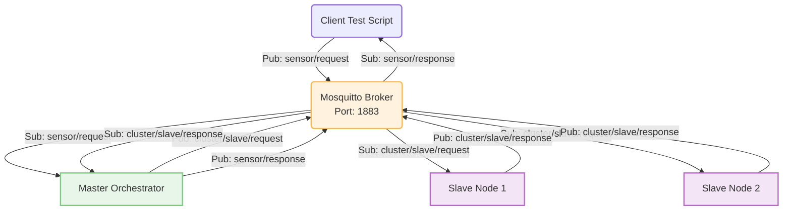

# `master/` — Section 3 Master Node

Quick-start for **this node only**. For the full picture (MQTT version/
QoS rationale, topic structure, communication diagrams) see
[`../README.md`](../README.md) and [`../Report.md`](../Report.md).

## What this node does

Runs `master_node`: no HTTP/NGINX anymore — it's a Mosquitto **broker**
(configured by this same `run.sh`) plus an MQTT **client** that
subscribes to `sensor/request` and `cluster/slave/response`, answers a
query from its own cache/DB if it can, or fans the query out to both
slaves over `cluster/slave/request` and waits (up to 1500 ms) for
whichever answers first, then publishes the final answer to
`sensor/response`. See the sequence diagram in `../Report.md` Section 3
for the full flow, including how it decides between "first slave that
found it" and "both slaves said NOT_FOUND".



## Setup

```bash
cd master
./run.sh
# Enter target Master SQLite DB path [../master.db]: ../master.db
# Enter MQTT Broker Endpoint [tcp://127.0.0.1:1883]: tcp://127.0.0.1:1883
```

`run.sh` will:
1. Install any of `libsqlite3-dev`, `memcached`, `libmemcached-dev`,
   `libpaho-mqtt-dev`, `mosquitto` that are missing (`dpkg -s` check per
   package).
2. Write `/etc/mosquitto/conf.d/local.conf` (`listener 1883 0.0.0.0`,
   `allow_anonymous true`) if not already present, and restart
   Mosquitto.
3. Set Memcached to listen on `0.0.0.0` instead of `127.0.0.1` (needed
   so `client_tests/value_test.sh`'s remote `flush_all` can reach it)
   and restart it.
4. Make sure both `memcached` and `mosquitto` are running.
5. Prompt for the DB path and broker endpoint, write `env`, compile,
   and run `./master_node` in the foreground.

Run this **before** the slaves (they need the broker up to connect to).

## Files here

| File | Purpose |
|---|---|
| `src/main.cpp` | `master_node` source — MQTT client, cache/DB check, fan-out-and-wait to slaves |
| `Makefile` | `make` / `make clean` — links `-lsqlite3 -lmemcached -lpaho-mqtt3c` |
| `run.sh` | Installs deps incl. Mosquitto, configures + starts the broker, compiles, runs |
| `env` | Generated by `run.sh` (`DB_PATH`, `MQTT_BROKER`) |

## Stopping it

`Ctrl+C`/`SIGTERM` — caught, disconnects from MQTT cleanly. Mosquitto
and Memcached themselves keep running as systemd services afterward.
