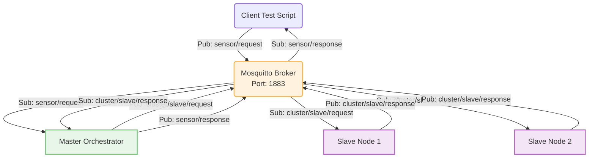

```mermaid
graph TD
    classDef client fill:#ececff,stroke:#9370db,stroke-width:2px;
    classDef broker fill:#fff3e0,stroke:#ffb74d,stroke-width:2px;
    classDef master fill:#e8f5e9,stroke:#81c784,stroke-width:2px;
    classDef slave fill:#f3e5f5,stroke:#ba68c8,stroke-width:2px;

    Client(Client Test Script):::client
    Broker(Mosquitto Broker<br>Port: 1883):::broker
    Master[Master Orchestrator]:::master
    Slave1[Slave Node 1]:::slave
    Slave2[Slave Node 2]:::slave

    %% Client Pipeline
    Client -->|Pub: sensor/request| Broker
    Broker -->|Sub: sensor/request| Master

    %% Internal Cascade Pipeline
    Master -->|Pub: cluster/slave/request| Broker
    Broker -->|Sub: cluster/slave/request| Slave1
    Broker -->|Sub: cluster/slave/request| Slave2

    %% Internal Cascade Response
    Slave1 -->|Pub: cluster/slave/response| Broker
    Slave2 -->|Pub: cluster/slave/response| Broker
    Broker -->|Sub: cluster/slave/response| Master

    %% Final Return Pipeline
    Master -->|Pub: sensor/response| Broker
    Broker -->|Sub: sensor/response| Client
```