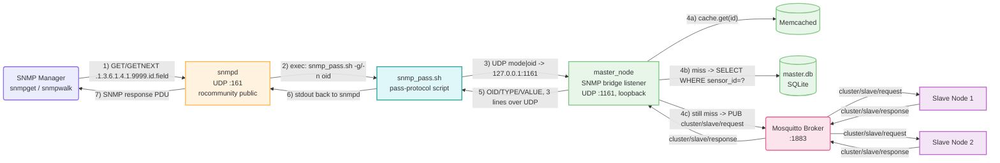

# Section 4 — Reading Sensor Information using the SNMP Protocol

Same distributed sensor cluster as Sections 1–3 (Master + 2 Slaves,
each with its own local SQLite DB and Memcached cache, all still talking
to each other over **MQTT** exactly as in Section 3). What's new in this
section is a read-only **SNMP agent on the Master VM**: an operator (or
any standard SNMP manager/tool — `snmpget`, `snmpwalk`, a monitoring
system like Zabbix/Nagios/LibreNMS) can now query sensor name,
description, and last value through ordinary SNMP `GET`/`GETNEXT`
requests against a **custom OID subtree**, without knowing anything
about MQTT, Memcached, or SQLite underneath. `snmpd` (Net-SNMP's agent
daemon) is used as required, extended with the **`pass` capability**
to delegate the custom subtree to a small bridge script that talks to
`master_node` itself.

```
Phase4/
├── master/
│   ├── src/main.cpp       # master_node — same MQTT orchestrator as Section 3, PLUS an SNMP bridge listener (UDP :1161)
│   ├── scripts/
│   │   └── snmp_pass.sh   # pass-protocol script snmpd executes for the custom OID subtree
│   ├── Makefile
│   ├── env                 # generated by run.sh (DB_PATH, MQTT_BROKER, SENSOR_IDS)
│   └── run.sh               # installs deps incl. snmp/snmpd, deploys the pass script, writes snmpd.conf, compiles, runs
├── slave/
│   ├── src/main.cpp        # slave_node — unchanged from Section 3, no SNMP code here
│   ├── Makefile
│   ├── env                  # generated by run.sh (DB_PATH, MQTT_BROKER)
│   └── run.sh                # installs deps, compiles, runs (used for both slaves)
├── client_tests/
│   └── value_test.sh          # snmpget/snmpwalk-based two-round correctness + response-time test
├── figure/                     # screenshots + communication diagrams
├── README.md                    # this file
└── Report.md                     # SNMP/OID/MIB write-up, snmpd config rationale, data-path diagrams
```

> **Note on the proposed layout:** `master/scripts/snmp_pass.sh` is the
> "Script related to custom OID fields" deliverable; `client_tests/value_test.sh`
> is both the "Script to read all sensors" and the SNMP test script
> (it drives `snmpget` per-sensor, then a full `snmpwalk` of the tree);
> `master/run.sh` is "Compilation and execution script" and also writes
> the "SNMP configuration files" deliverable (`/etc/snmp/snmpd.conf`)
> itself rather than shipping it as a static file the repo would need to
> copy into place by hand — see item 2 below for exactly what it writes.
> There is no separate top-level Makefile; `master/Makefile` and
> `slave/Makefile` (`make` / `make clean`) are unchanged from Sections
> 1–3.

## 1. How to install SNMP packages

`master/run.sh` installs everything needed automatically (checking
`dpkg -s <package>` first, same pattern as every other dependency in
this project), so nothing below needs to be run by hand — it's
included here because the Section 4 deliverables explicitly ask for it:

```bash
sudo apt update
sudo apt install -y snmp snmpd netcat-openbsd
```

| Package | Provides | Used for |
|---|---|---|
| `snmpd` | The Net-SNMP **agent daemon** (`/usr/sbin/snmpd`) | Runs on the Master VM only; answers SNMP requests on UDP `161` |
| `snmp` | Client tools — `snmpget`, `snmpwalk`, `snmpgetnext`, `snmptranslate` | Used from *any* machine (Master or elsewhere) to query the agent — see items 5 and 6 |
| `netcat-openbsd` | `nc` | Used by `master/scripts/snmp_pass.sh` to relay each request to `master_node`'s internal UDP bridge listener (port `1161`, loopback-only) — see item 3 and `Report.md` Section 6 |

The Master VM only needs `snmpd`; a pure "operator" machine only needs
the `snmp` client package (`snmpget`/`snmpwalk`). `master/run.sh`
installs both plus `netcat-openbsd` on the Master VM since it needs to
*run* the agent and the bridge script needs `nc`.

## 2. How to configure `snmpd`

`master/run.sh` writes `/etc/snmp/snmpd.conf` itself (overwriting any
existing file) and restarts the service:

```
# /etc/snmp/snmpd.conf  (written by master/run.sh)
agentAddress udp:161
rocommunity public default
view systemview included .1.3.6.1.4.1.9999
pass .1.3.6.1.4.1.9999 /bin/bash /usr/local/bin/snmp_pass.sh
```

| Directive | Meaning |
|---|---|
| `agentAddress udp:161` | Listen for SNMP requests on **UDP port 161** (the standard SNMP port) on **all** interfaces, so any machine that can reach the Master's IP can query it — not just `localhost`. |
| `rocommunity public default` | Enable **SNMPv1/v2c**, community string `public`, **read-only** (`ro`), accepted from `default` (any source address — no ACL restriction). This is what `snmpget -v2c -c public ...` / `snmpwalk -v2c -c public ...` authenticate with. |
| `view systemview included .1.3.6.1.4.1.9999` | By default Net-SNMP's built-in `systemview` only covers the standard `.1.3.6.1.2.1` (`mib-2`) subtree; this line explicitly adds our custom `.1.3.6.1.4.1.9999` (**enterprise OID**) subtree to that same view so it's actually visible to `rocommunity`-authenticated requests — without it, `snmpd` would report "No Such Object" for every custom OID even though the `pass` script below is registered correctly. |
| `pass .1.3.6.1.4.1.9999 /bin/bash /usr/local/bin/snmp_pass.sh` | The **`pass` capability**: registers `/usr/local/bin/snmp_pass.sh` as the handler for the entire `.1.3.6.1.4.1.9999` subtree. `snmpd` executes it directly (via `/bin/bash`) for every `GET`/`GETNEXT`/`SET` under that OID and relays back whatever it prints on stdout — see `Report.md` Section 5 for the exact protocol. |

Two setup details `run.sh` also takes care of that matter for `pass` to
actually work:

- **The script is copied to a stable, world-readable path**,
  `/usr/local/bin/snmp_pass.sh` (`sudo cp` + `chmod 755`), rather than
  being pointed at directly inside a user's project checkout — `snmpd`
  runs as the unprivileged `Debian-snmp` system user, which is not
  guaranteed to have traversal/execute permission into an arbitrary
  home directory.
- **`sudo systemctl restart snmpd`** is run immediately after the
  config is written, since `snmpd` only re-reads `snmpd.conf` on
  startup, not on `SIGHUP` by default in this setup.

## 3. The structure of the defined OIDs

**Base (enterprise) OID:** `.1.3.6.1.4.1.9999` — a private-enterprise
number picked for this project (no real IANA registration; fine for a
lab/coursework MIB). Under it, every sensor gets a fixed 2-level path
keyed by its **globally-unique `sensor_id`**, with three leaves:

```
.1.3.6.1.4.1.9999.<sensor_id>.1   ->  sensor name          (OCTET STRING)
.1.3.6.1.4.1.9999.<sensor_id>.2   ->  sensor description    (OCTET STRING)
.1.3.6.1.4.1.9999.<sensor_id>.3   ->  last stored value      (OCTET STRING)
```

For example, sensor `101` (a Master-local temperature sensor):

| OID | Field | Example value |
|---|---|---|
| `.1.3.6.1.4.1.9999.101.1` | Name | `TempSensor-101` |
| `.1.3.6.1.4.1.9999.101.2` | Description | `TempSensor-101 - temperature sensor @ Room A (unit: C)` |
| `.1.3.6.1.4.1.9999.101.3` | Last value | `24.8` |

The **set of sensor IDs exposed** is not hardcoded into `master_node` —
it's read from the `SENSOR_IDS` environment variable (comma-separated),
which `master/run.sh` prompts for and writes into `env`, defaulting to
every sensor across the whole cluster (Master + both Slaves):
`101,102,103,104,201,202,203,204,301,302,303,304`. Because a
`sensor_id` is unique cluster-wide, `master_node` doesn't need to know
*which node* a sensor lives on ahead of time — resolving it is exactly
the same cache → local‑DB → MQTT‑cascade lookup Section 3 already does
for a plain query (see item 7 and `Report.md` Section 6).

`master/src/main.cpp` walks this tree in strict ascending
`(sensor_id, field)` order for `GETNEXT`/`snmpwalk` (`find_next_leaf()`),
so a walk always visits `101.1, 101.2, 101.3, 102.1, 102.2, 102.3, ...`
in order and correctly reports end-of-MIB once the last configured
sensor's field `3` is passed.

## 4. How to run the SNMP service

Everything is driven by `master/run.sh` — there is no separate
"start SNMP" step:

```bash
cd master
./run.sh
# installs snmp, snmpd, netcat-openbsd (if missing) alongside the
# Section 1-3 deps (sqlite3, memcached, libpaho-mqtt-dev, mosquitto)
#  -> copies scripts/snmp_pass.sh to /usr/local/bin/snmp_pass.sh
#  -> writes /etc/snmp/snmpd.conf (see item 2) and restarts snmpd
#  -> configures + restarts mosquitto and memcached (unchanged from Section 3)
# Enter target Master SQLite DB path [../master.db]: ../master.db
# Enter MQTT Broker Endpoint [tcp://127.0.0.1:1883]: tcp://127.0.0.1:1883
# Enter comma-separated SNMP-exposed sensor IDs [101,...,304]:
#  -> compiles and runs ./master_node in the foreground
```

`master_node` itself opens a **loopback-only UDP listener on port
`1161`** (`snmp_listener_loop()`) the moment it starts — this is *not*
the SNMP port a manager talks to; it's the private bridge between
`snmpd`'s `pass` script and the Master process (see item 7 and
`Report.md` Section 6). You'll see this line at startup:

```
[SNMPD-PASS] Bridge listener active on UDP port 1161
```

`snmpd` itself is already running as a systemd service by the time
`run.sh` starts `master_node` (`systemctl restart snmpd` happens during
the config step) and keeps running independently of `master_node`'s
foreground process — restarting `master_node` does **not** require
restarting `snmpd`, since the `pass` script simply forwards each
request over UDP and gets nothing back (which `snmpd` reports as "No
Such Instance") if `master_node` isn't listening.

Slaves are started exactly as in Section 3 (no SNMP involvement on
their side at all):

```bash
cd slave && ./run.sh   # once per slave VM, pointed at the Master's broker
```

## 5. How to read information using `snmpwalk`

From the Master VM itself, or any machine that can reach it on UDP
`161`:

```bash
# A single field
snmpget -v2c -c public 192.168.56.101:161 .1.3.6.1.4.1.9999.101.3
# SNMPv2-SMI::enterprises.9999.101.3 = STRING: "24.8"

# The next leaf after a given OID (used internally by snmpwalk)
snmpgetnext -v2c -c public 192.168.56.101:161 .1.3.6.1.4.1.9999.101.3
# SNMPv2-SMI::enterprises.9999.102.1 = STRING: "TempSensor-102"

# The whole custom subtree, every sensor, all three fields each
snmpwalk -v2c -c public 192.168.56.101:161 .1.3.6.1.4.1.9999
```

`-v2c` selects SNMPv2c, `-c public` supplies the community string
configured by `rocommunity public default` (item 2). See
`figure/client_snmpwalk.png` for a captured full-tree walk.

## 6. How to run the test script

```bash
cd client_tests
./value_test.sh
# Enter Target Host IP [192.168.56.101]:
```

It runs **two benchmark rounds** of `snmpget` against three known
sensors (one per node: Master `101`, Slave 1 `201`, Slave 2 `301`),
timing each round-trip and checking the returned value against what's
actually in that sensor's DB, after first flushing the Master's
Memcached (`flush_all` over `nc` to port `11211`) so Round 1 is
guaranteed cold. It finishes with a full `snmpwalk` dump of the entire
`.1.3.6.1.4.1.9999` subtree so every exposed sensor's three fields are
printed in one shot. See `figure/client_value_output.png` and
`figure/client_snmpwalk.png` for captured runs, and `Report.md` Section
8 for the round-1-vs-round-2 timing analysis.

## 7. Data path: from the database to the SNMP output

A `snmpget`/`snmpwalk` for `.1.3.6.1.4.1.9999.<id>.<field>` crosses
**four** processes before it reaches an actual row of data — see the
diagram below and `Report.md` Section 6 for the fully worked-through
sequence:

1. **SNMP manager → `snmpd`** — a standard SNMPv2c `GET`/`GETNEXT` PDU
   over UDP `161`.
2. **`snmpd` → `snmp_pass.sh`** — via the `pass` capability, `snmpd`
   executes the script directly (`snmp_pass.sh -g <oid>` or
   `-n <oid>`) and reads its stdout.
3. **`snmp_pass.sh` → `master_node`'s bridge listener** — the script
   re-packages the request as `"<mode>|<oid>"` and sends it over UDP
   to `127.0.0.1:1161` (`nc -u -w1`), then relays back whatever
   `master_node` replies with (or nothing, on a 1-second timeout).
4. **`master_node`'s bridge listener → cache → local SQLite → MQTT
   cascade** — exactly the Section 3 `resolve_sensor_record()` cascade:
   Memcached first, then this node's own `sensors`/`sensor_readings`
   tables, and only on a full local miss does it publish
   `cluster/slave/request` over MQTT and wait (up to 1500 ms) for
   whichever slave answers — identical to how a plain MQTT client query
   was resolved in Section 3, just triggered by an SNMP request instead
   of a `sensor/request` MQTT publish.



`Report.md` Section 6 has the full request/response sequence diagram,
including the cache-hit shortcut (skips steps 4b/4c entirely) and how a
`GETNEXT` walk differs from a plain `GET` (`find_next_leaf()` vs.
`is_known_sensor()` — see item 3 above).
