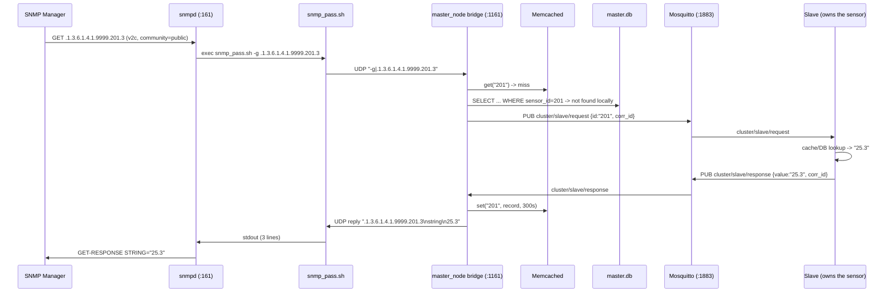
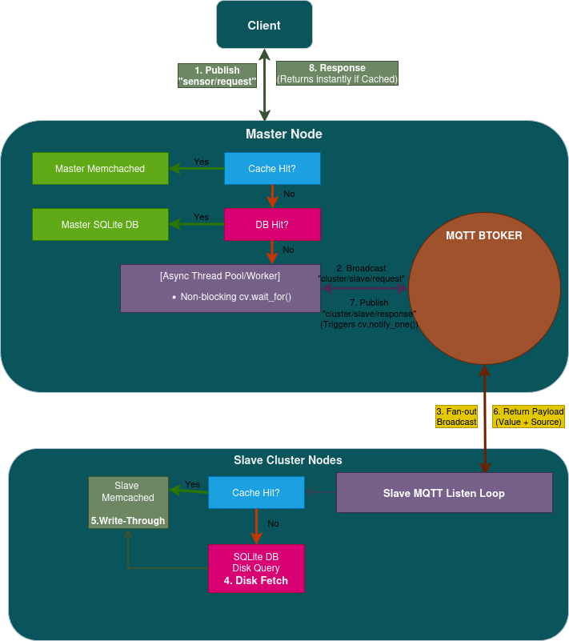
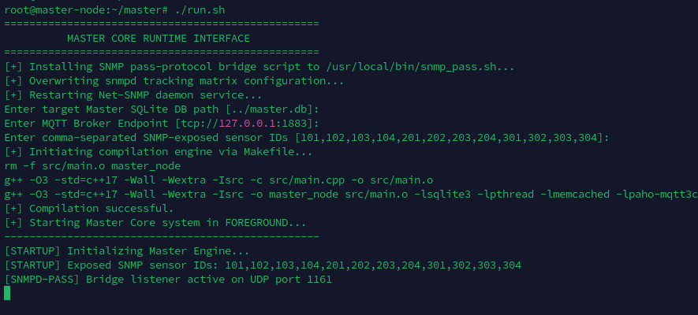
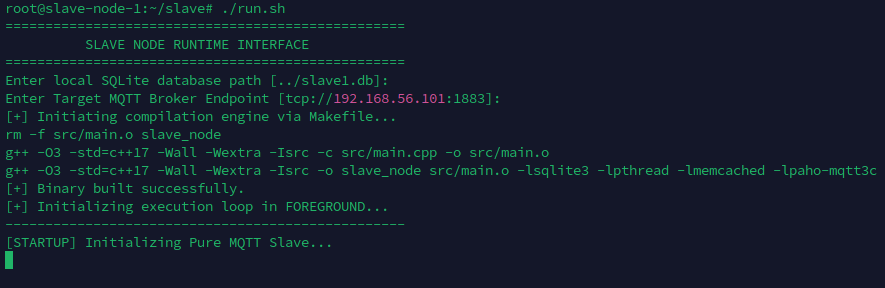
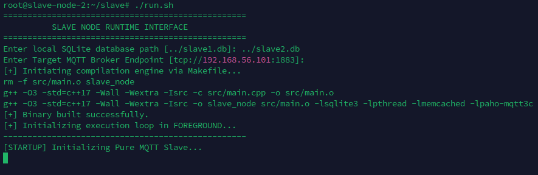
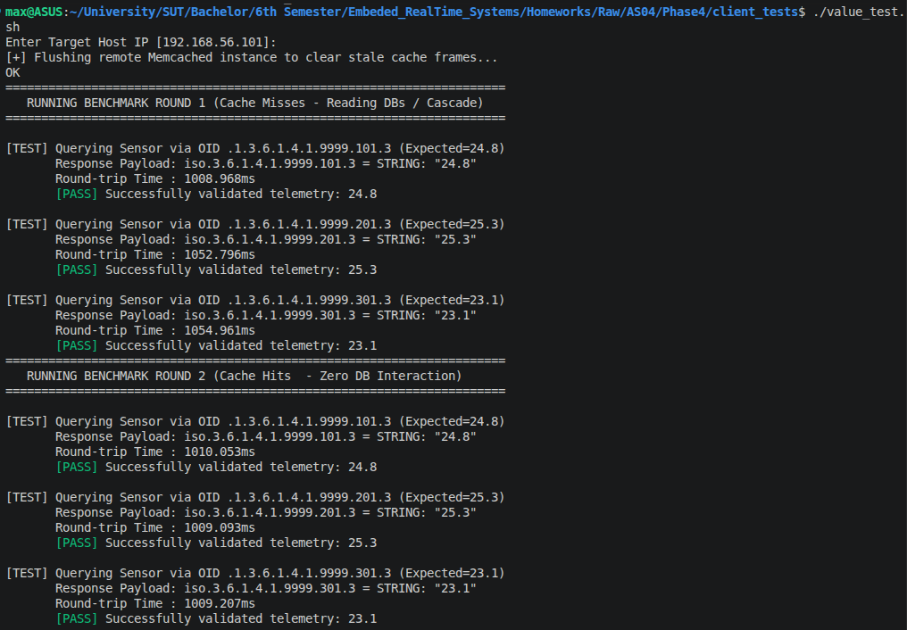
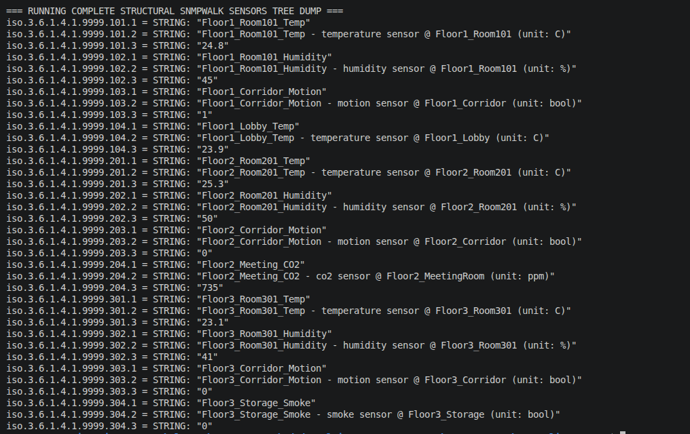

# Report — Section 4: Reading Sensor Information using the SNMP Protocol

## 1. Overview

Section 4 adds a **read-only SNMP agent** to the Master VM, sitting on
top of the exact same cluster Section 3 built: one Master and two Slave
nodes, each with a local SQLite DB and Memcached cache, coordinating
over MQTT. Nothing about the MQTT layer changes — `slave/src/main.cpp`
is byte-for-byte the Section 3 slave. What's new lives entirely on the
Master: `master/src/main.cpp` gained a small **UDP bridge listener**
(port `1161`, loopback-only) that Net-SNMP's `snmpd` daemon can reach
through a **`pass`-protocol script**, so a standard SNMP manager can
`GET`/`GETNEXT` sensor name/description/last-value for *any* sensor in
the cluster — Master or Slave — without knowing MQTT exists.

## 2. What is SNMP, and why use it here

**SNMP (Simple Network Management Protocol)** is a standard
application-layer protocol for monitoring and managing devices on a
network — originally designed for routers/switches, now used broadly
for anything exposing operational metrics (servers, printers, UPS
units, and — as here — an arbitrary sensor cluster). It follows a
**manager/agent** model:

- An **agent** (here, `snmpd` on the Master VM) runs on the managed
  device and exposes a tree of named data points.
- A **manager** (any tool implementing the protocol — `snmpget`,
  `snmpwalk`, or a full monitoring platform) sends requests to the
  agent and receives responses, all over **UDP**, historically port
  `161` for agent requests and `162` for unsolicited agent-to-manager
  traps.
- Three SNMP versions exist: **v1** (the original, plaintext community
  strings only), **v2c** (adds `GETBULK` and better error handling,
  still plaintext community-string auth — what this project uses), and
  **v3** (adds real user-based authentication and encryption). v2c was
  chosen here because it's what `rocommunity` in `snmpd.conf`
  configures most directly and is more than adequate for a lab network;
  see Section 9 for what that trades away.

**Why SNMP fits this use case:** the whole point of Sections 1–3 was to
let an operator query a sensor without knowing which physical node
holds it. SNMP is a natural "read-only monitoring" layer on top of
that: any of dozens of existing tools (or a five-line script) can pull
sensor data through one well-known protocol and one fixed port, instead
of needing to speak this project's bespoke JSON-over-MQTT schema.

## 3. MIB and OID — the two concepts SNMP is built on

- **OID (Object Identifier)** — a dotted sequence of integers
  (`.1.3.6.1.4.1.9999.101.3`) that names exactly one data point in a
  global, hierarchical namespace, the same tree standard used for X.509
  certificates and LDAP. Reading left to right, each number selects a
  child of the previous one: `.1.3.6.1.4.1` is the standard "private
  enterprise" branch, and `.9999` is this project's (unregistered, for
  lab purposes) enterprise number — everything under it is ours to
  define however we like.
- **MIB (Management Information Base)** — a *document* (conventionally
  written in ASN.1) that gives OIDs human-readable names, types, and
  descriptions — e.g. mapping `.1.3.6.1.2.1.1.1` to `sysDescr`, a
  `DisplayString`. A real production deployment of this project's
  custom subtree would ship a `.mib`/`.txt` MIB file describing
  `sensorName`/`sensorDescription`/`sensorValue` under
  `enterprises.9999`, so `snmptranslate`/`snmpwalk -O n` could resolve
  friendly names instead of raw numeric OIDs. This project does **not**
  ship a compiled MIB file — every OID is read and constructed as a
  raw numeric string, which is why every example in `README.md` uses
  `.1.3.6.1.4.1.9999...` rather than a symbolic name. See Section 9 for
  the impact of that gap.
- **Net-SNMP's `pass` capability** is what connects the two: it tells
  `snmpd` "for any OID under this subtree, don't look it up in a
  compiled MIB or built-in table — execute this external program and
  trust whatever it returns instead." That's what turns a static
  document (a MIB) into a live bridge onto a running C++ process (see
  Section 5).

## 4. `snmpd` configuration, explained

`master/run.sh` writes `/etc/snmp/snmpd.conf` verbatim as:

```
agentAddress udp:161
rocommunity public default
view systemview included .1.3.6.1.4.1.9999
pass .1.3.6.1.4.1.9999 /bin/bash /usr/local/bin/snmp_pass.sh
```

- `agentAddress udp:161` binds the agent to the standard SNMP port on
  every interface, so it's reachable cluster-wide, not just from
  `localhost`.
- `rocommunity public default` is the **v1/v2c** read-only
  authentication line: any request presenting community string
  `public` is accepted, from any source IP (`default`). This is the
  single biggest simplification in this setup — see Section 9.
- `view systemview included .1.3.6.1.4.1.9999` is easy to miss but
  required: Net-SNMP's default `systemview` ACL view only whitelists
  the standard `mib-2` tree (`.1.3.6.1.2.1`); without explicitly adding
  our enterprise OID to that view, `rocommunity`-authenticated requests
  would be rejected with "No Such Object" even though the `pass`
  handler below is correctly registered — configuring the *handler*
  and configuring *visibility* are two separate steps in Net-SNMP.
- `pass .1.3.6.1.4.1.9999 /bin/bash /usr/local/bin/snmp_pass.sh`
  delegates the entire subtree to an external script (Section 5). The
  script is deployed to `/usr/local/bin/` (not left inside the repo
  checkout) and made world-readable/executable, since `snmpd` runs as
  the unprivileged `Debian-snmp` system user and needs to traverse to
  and execute it.

## 5. The `pass` protocol and `master/scripts/snmp_pass.sh`

Net-SNMP's `pass` capability defines a small, fixed wire protocol
between `snmpd` and the external script it delegates to. `snmpd`
invokes the script as a subprocess for every request under the
registered subtree, passing the operation and OID as **command-line
arguments**:

| Invocation | SNMP operation | Expected stdout on success |
|---|---|---|
| `snmp_pass.sh -g <oid>` | `GET` — the exact OID | 3 lines: `<oid>`, `<type>`, `<value>` |
| `snmp_pass.sh -n <oid>` | `GETNEXT` — the next OID after this one (what `snmpwalk` uses repeatedly) | same 3-line shape, but for the *next* leaf, not `<oid>` itself |
| `snmp_pass.sh -s <oid> <value>` | `SET` | (unused — this agent is read-only; the script exits 0 with no output) |

Printing **nothing** (or exiting without the 3-line shape) tells
`snmpd` "No Such Instance" for a `GET`, or "end of MIB view" for a
`GETNEXT` that's run off the end of the tree.

`master/scripts/snmp_pass.sh` implements this by **not** answering the
request itself — it's a thin relay onto `master_node`:

```bash
RESPONSE=$(printf '%s|%s' "$MODE" "$OID" | nc -u -w 1 127.0.0.1 1161)
if [ -n "$RESPONSE" ]; then
    printf '%s\n' "$RESPONSE"
fi
```

It re-packages `-g`/`-n` and the OID into a single line, `<mode>|<oid>`,
and sends it as one UDP datagram to `master_node`'s bridge listener on
`127.0.0.1:1161`, then prints back whatever comes over the same UDP
socket within one second (`nc -u -w 1`), or nothing if the timeout
expires. This design keeps `master_node` as the **single source of
truth** for the sensor tree (it already has the cache/DB/MQTT cascade
built for Section 3) — the pass script and `snmpd` never touch SQLite,
Memcached, or MQTT directly, they just relay bytes.

## 6. Custom OID design and the full data path

The subtree is a flat, 2-level scheme keyed by the cluster-wide-unique
`sensor_id`:

```
.1.3.6.1.4.1.9999.<sensor_id>.1  ->  name
.1.3.6.1.4.1.9999.<sensor_id>.2  ->  description
.1.3.6.1.4.1.9999.<sensor_id>.3  ->  last value
```

Inside `master_node`, `parse_oid_pos()` splits an incoming OID into
`(sensor_id, field)`, and two different lookups serve `-g` vs. `-n`:
`is_known_sensor()` (a simple membership check against the
`SENSOR_IDS`-derived list) for `GET`, and `find_next_leaf()` — a linear
scan for the first `(id, field)` strictly greater than the current
position in ascending order — for `GETNEXT`/`snmpwalk`. Both funnel
into the same `build_response(id, field)`, which in turn calls
`resolve_sensor_record()` — **the exact same cache → local-DB →
MQTT-cascade function that resolved a plain MQTT `sensor/request` in
Section 3** — so an SNMP `GET` and an MQTT query for the same sensor
share every byte of resolution logic; SNMP is purely a different
front door onto the same backend.

**Full request/response sequence** for a cold `GET` on a sensor that
lives on a Slave (the most expensive path — a cache/DB hit on the
Master short-circuits at step 5 or 7):



A **cache hit** (any repeat query within the 300-second TTL, on any of
the three fields for that sensor — since all three share one
`resolve_sensor_record()` call) collapses everything from "Bridge"
onward into a single `Cache` lookup, skipping SQLite and MQTT entirely
— the same warm-cache speedup Sections 2–3 measured for plain queries,
now visible through SNMP (Section 8).

## 7. Reading values — `snmpget` / `snmpwalk`, and the test script

`client_tests/value_test.sh` exercises both individual reads and a
full-tree walk in one script: two timed rounds of `snmpget` (v2c,
community `public`) against one sensor per node — Master `101`, Slave 1
`201`, Slave 2 `301` — after flushing the Master's Memcached so Round 1
starts cold, followed by one full `snmpwalk` of `.1.3.6.1.4.1.9999`
covering every configured sensor's three fields. See `README.md` items
5–6 for the exact commands and `figure/client_value_output.png` /
`figure/client_snmpwalk.png` for captured output.

## 8. Response-time analysis (Round 1 vs. Round 2)

- **Round 1** (post-flush) pays the full path from Section 6's sequence
  diagram for the two non-Master sensors: `snmpd` → `snmp_pass.sh` →
  UDP to `master_node` → Master cache miss → Master local-DB miss →
  MQTT fan-out to both slaves → whichever slave answers → cache
  populated → 3-line reply relayed all the way back. The Master's own
  sensor (`101`) skips the MQTT hop but still pays a local SQLite read.
- **Round 2** repeats the identical three queries. Because Round 1 just
  populated the Master's Memcached for all three (`resolve_sensor_record()`
  caches on every non-miss path, local or via MQTT — the same
  never-cache-negatives rule from Section 2/3), every Round 2 lookup
  resolves at the `Cache.get()` call inside the bridge listener, before
  either SQLite or MQTT is touched — the round-trip becomes `snmpd` →
  `snmp_pass.sh` → UDP → Memcached → UDP → `snmpd` → manager, several
  hops lighter than Round 1 for the two non-Master sensors.
- The final `snmpwalk` benefits from the same effect within a single
  walk: fields 2 and 3 of a given sensor are essentially free once
  field 1 has paid the resolution cost, since all three leaves for one
  `sensor_id` share the one cached `SensorRecord`.

See `figure/client_value_output.png` for the actual captured
per-query timings from a real run; exact milliseconds depend on the
VMs the screenshot was taken on, so this report describes the
qualitative shape of the speedup rather than restating specific numbers.

## 9. Output figures

**Figure 1 — Communication diagram (Client / Broker / Master / Slaves)**



**Figure 2 — Master node output**



**Figure 3 — Slave 1 node output**



**Figure 4 — Slave 2 node output**



**Figure 5 — `client_tests/value_test.sh` output**



**Figure 6 — Full `snmpwalk` of the custom OID subtree**


