# `master/` — Section 4 Master Node

Quick-start for **this node only**. For the full picture (SNMP/OID/MIB
explanation, `snmpd` config rationale, data-path diagrams) see
[`../README.md`](../README.md) and [`../Report.md`](../Report.md).

## What this node does

Runs `master_node`: everything it did in Section 3 (MQTT client —
subscribes to `sensor/request`/`cluster/slave/response`, answers from
its own cache/DB, or fans a query out to both slaves over
`cluster/slave/request`), **plus** a small **SNMP bridge listener** — a
loopback UDP socket on port `1161` (`snmp_listener_loop()`, its own
thread) that speaks a 1-line `"<mode>|<oid>"` protocol to
`scripts/snmp_pass.sh`, which `snmpd` (installed and configured by this
same `run.sh`) executes for every SNMP request under
`.1.3.6.1.4.1.9999`. Every `GET`/`GETNEXT` resolves through the exact
same cache → local-DB → MQTT-cascade function Section 3 already had
(`resolve_sensor_record()`) — SNMP is a second front door onto the same
backend, not a separate data path. See the sequence diagram in
`../Report.md` Section 6 for the full request flow.

```mermaid
flowchart LR
    classDef mgr fill:#ececff,stroke:#9370db,stroke-width:2px;
    classDef snmp fill:#fff3e0,stroke:#ffb74d,stroke-width:2px;
    classDef master fill:#e8f5e9,stroke:#81c784,stroke-width:2px;
    classDef broker fill:#fce4ec,stroke:#f06292,stroke-width:2px;
    classDef slave fill:#f3e5f5,stroke:#ba68c8,stroke-width:2px;

    Mgr(SNMP Manager):::mgr
    Agent[snmpd :161 + snmp_pass.sh]:::snmp
    Master[master_node<br>bridge :1161 + MQTT client]:::master
    Broker(Mosquitto Broker :1883):::broker
    S1[Slave Node 1]:::slave
    S2[Slave Node 2]:::slave

    Mgr -- "GET/GETNEXT .1.3.6.1.4.1.9999.*" --> Agent
    Agent -- "UDP mode|oid -> 127.0.0.1:1161" --> Master
    Master -- "cache/DB hit? reply directly" --> Agent
    Master -- "miss: PUB cluster/slave/request" --> Broker
    Broker --> S1
    Broker --> S2
    S1 -- "cluster/slave/response" --> Broker
    S2 -- "cluster/slave/response" --> Broker
    Broker --> Master
    Master -- "3-line OID/TYPE/VALUE reply" --> Agent
    Agent --> Mgr
```



## Setup

```bash
cd master
./run.sh
# Enter target Master SQLite DB path [../master.db]: ../master.db
# Enter MQTT Broker Endpoint [tcp://127.0.0.1:1883]: tcp://127.0.0.1:1883
# Enter comma-separated SNMP-exposed sensor IDs [101,...,304]:
```

`run.sh` will:
1. Install any of `libsqlite3-dev`, `memcached`, `libmemcached-dev`,
   `libpaho-mqtt-dev`, `mosquitto`, `snmp`, `snmpd`, `netcat-openbsd`
   that are missing (`dpkg -s` check per package).
2. Copy `scripts/snmp_pass.sh` to `/usr/local/bin/snmp_pass.sh`
   (`chmod 755`) — a stable, world-readable/executable path, since
   `snmpd` runs as the unprivileged `Debian-snmp` user.
3. Overwrite `/etc/snmp/snmpd.conf` (`agentAddress udp:161`,
   `rocommunity public default`, the `.1.3.6.1.4.1.9999` view, and the
   `pass` directive pointing at the script above) and restart `snmpd`.
4. Write/restart Mosquitto's config (`allow_anonymous true`, listening
   on `0.0.0.0:1883`) and point Memcached at `0.0.0.0` — unchanged from
   Section 3.
5. Make sure `memcached`, `mosquitto`, and `snmpd` are all running.
6. Prompt for the DB path, broker endpoint, and the comma-separated
   `SENSOR_IDS` to expose over SNMP; write `env`; compile; run
   `./master_node` in the foreground.

Run this **before** the slaves (they need the broker up to connect to).
`master_node` logs `[SNMPD-PASS] Bridge listener active on UDP port
1161` once its SNMP bridge thread is up, alongside its usual MQTT
subscription log line.

## Files here

| File | Purpose |
|---|---|
| `src/main.cpp` | `master_node` source — MQTT client + cache/DB cascade (Section 3) + SNMP bridge listener on UDP `1161` (Section 4) |
| `scripts/snmp_pass.sh` | The Net-SNMP `pass`-protocol script; relays `snmpd`'s `-g`/`-n`/`-s` calls to `master_node` over UDP and prints back whatever it returns |
| `Makefile` | `make` / `make clean` — links `-lsqlite3 -lmemcached -lpaho-mqtt3c -lpthread` |
| `run.sh` | Installs deps incl. `snmpd`, deploys the pass script, writes `snmpd.conf`, configures Mosquitto/Memcached, compiles, runs |
| `env` | Generated by `run.sh` (`DB_PATH`, `MQTT_BROKER`, `SENSOR_IDS`) |

## Stopping it

`Ctrl+C`/`SIGTERM` — caught, disconnects from MQTT cleanly and stops
the SNMP bridge listener thread. `snmpd`, Mosquitto, and Memcached
themselves keep running as systemd services afterward; restarting
`master_node` alone does **not** require restarting `snmpd` (a request
arriving while `master_node` is down just times out inside
`snmp_pass.sh` and `snmpd` reports "No Such Instance").
