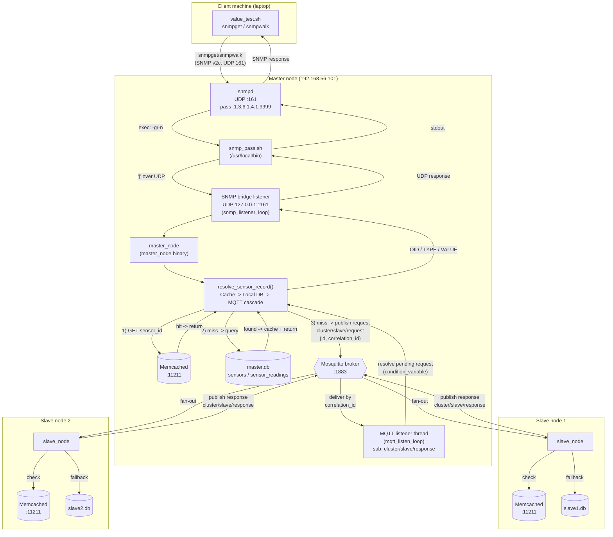
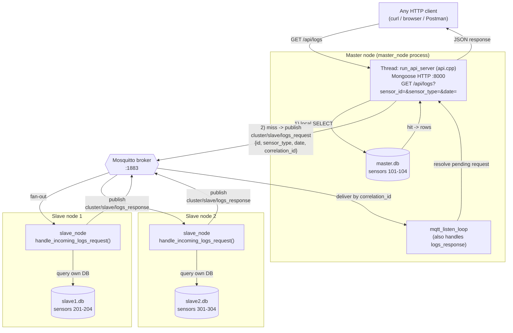

# Distributed Sensor Cluster — Full Project (Phases 1–5)

## Layout

```
project/
├── master/     # Master node: SNMP bridge + cache/DB/MQTT cascade (Phases 1-4)
│               # PLUS the Section 5 Sensor Log API, embedded in the same binary
│   ├── src/main.cpp    Master engine (SNMP bridge listener, MQTT listener)
│   ├── src/api.cpp     Section 5: Mongoose HTTP API (embedded, own thread)
│   ├── src/api.h
│   ├── src/cluster.h   Shared MQTT helpers (logs cascade fallback to slaves)
│   ├── (src/mongoose.c / mongoose.h - fetched automatically by run.sh)
│   ├── Makefile         builds main.cpp + api.cpp + mongoose.c into master_node
│   ├── run.sh            installs deps, fetches Mongoose, compiles, runs everything
│   ├── API.md             Section 5 execution & testing guide
│   └── API_REPORT.md       Section 5 design report
├── slave/      # Slave node: local cache/DB responder over MQTT (Phases 1-4)
├── client/     # Laptop-side SNMP benchmark script (Phases 1-4)
└── docs/
    └── ARCHITECTURE.md   # Diagram + explanation of the full data flow
```

## Setup (per the project's strict "run.sh only" rule)

Each component is self-contained and driven entirely by its own
`run.sh` — install deps, configure, compile, and run all happen inside
that one script, with no other manual commands required on the target
machine. The Section 5 API is **not** a separate component: it starts
automatically as part of `master/run.sh`.

| Machine | Command |
|---|---|
| Master (192.168.56.101) | `cd master && ./run.sh` — starts SNMP bridge, MQTT listener, **and** the Sensor Log API |
| Slave 1 | `cd slave && ./run.sh` |
| Slave 2 | `cd slave && ./run.sh` |
| Laptop (benchmark) | `cd client && ./value_test.sh` |

See `docs/ARCHITECTURE.md` for how the SNMP/cache/DB/MQTT pieces connect,
and `master/API.md` + `master/API_REPORT.md` for the Section 5 API's
usage and design.


# Cluster Architecture — Phases 1 through 4

This document shows how the pieces built so far (SNMP bridge, Master
engine, Slave engines, Memcached, Mosquitto/MQTT, and the client
benchmark script) fit together, before the Phase 5 HTTP API is added.



## Component summary

| Component | Role |
|---|---|
| `client/value_test.sh` | Benchmark script; runs `snmpget`/`snmpwalk` against the master's SNMP port, flushes Memcached before each round to measure cache-miss vs cache-hit latency. |
| `snmpd` (Master) | Native Net-SNMP daemon; delegates the custom `.1.3.6.1.4.1.9999` subtree to the pass-protocol bridge script. |
| `snmp_pass.sh` (Master) | Thin bridge: re-packages `-g`/`-n` OID requests as `mode|oid` and forwards them over UDP to the master engine's internal listener on `127.0.0.1:1161`. |
| `master_node` (Master) | Runs two threads: the SNMP bridge listener (`snmp_listener_loop`) and the MQTT response listener (`mqtt_listen_loop`). Resolves every sensor lookup through a **cache → local DB → MQTT cascade** (`resolve_sensor_record`). |
| Memcached (per node) | 300s TTL cache of encoded sensor records (`type\x1Fname\x1Flocation\x1Funit\x1Fvalue`), checked first on every lookup to avoid repeat DB/MQTT hits. |
| `master.db` / `slave*.db` | SQLite databases; `sensors` (metadata) joined with `sensor_readings` (latest value) on `sensor_id`. |
| Mosquitto broker (`:1883`) | MQTT transport between the master and both slaves; topics `cluster/slave/request` and `cluster/slave/response`, correlated by a per-request `correlation_id`. |
| `slave_node` (Slave 1 & 2) | Subscribes to `cluster/slave/request`; on a miss in its own cache, falls back to its own local SQLite DB; publishes a `FOUND`/`NOT_FOUND` response back on `cluster/slave/response`. |

## Request lifecycle (single SNMP GET)

1. Client issues `snmpget`/`snmpwalk` → `snmpd` (UDP 161).
2. `snmpd` executes `snmp_pass.sh -g/-n <oid>` per the pass-protocol config.
3. The bridge script forwards `mode|oid` over UDP to the master engine's internal listener (`127.0.0.1:1161`).
4. The master engine resolves the sensor_id embedded in the OID through `resolve_sensor_record()`:
   - Memcached hit → return immediately.
   - Miss → query local `master.db`. Hit → cache it, return.
   - Miss → publish an MQTT request to both slaves and block (with a timeout) on a per-request `correlation_id`.
5. Each slave checks its own cache, then its own local DB, and replies on `cluster/slave/response`.
6. The first slave to report `FOUND` resolves the pending request; if both report `NOT_FOUND`, the master resolves it as not found.
7. The result flows back: engine → bridge script → `snmpd` → client, as a 3-line `OID / TYPE / VALUE` pass-protocol answer (or nothing, which `snmpd` reports as "No Such Instance"/"End of MIB view").

## Addendum — Phase 5: embedded Sensor Log API

Section 5 adds a third thread inside `master_node` itself: a Mongoose
HTTP server that answers historical, date-scoped log queries. It matches
on `sensor_id` + `sensor_type` + `date` (not `sensor_name`). It checks
the master's own `master.db` first; on a miss it falls back to the
slaves over a second MQTT topic pair
(`cluster/slave/logs_request` / `cluster/slave/logs_response`), so one
call to the master answers for any sensor in the cluster — mirroring the
existing SNMP cascade's cache→DB→MQTT fallback, but bypassing Memcached
(a multi-row, date-scoped history isn't a single cacheable value). It
runs automatically as part of `master/run.sh` — no separate process, no
separate `run.sh`.


