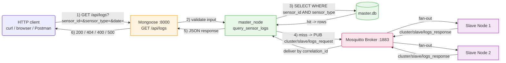

# Section 5 — API Development for Reading Sensor Logs

Same Master + 2 Slaves cluster as before. What's new in this section
is a read-only **HTTP API on the Master VM**, built with the
**Mongoose** embedded web server library: any HTTP client (`curl`, a
browser, Postman) can now ask for every value a given sensor recorded
on a given calendar date, without knowing anything about MQTT or
SQLite underneath. The API is compiled directly into the `master_node`
binary and runs as a third thread alongside the existing engine — no
separate program, no separate `run.sh`.

```
Phase5/
├── master/
│   ├── src/api.cpp        # the Mongoose HTTP handler (this section)
│   ├── src/api.h
│   ├── src/cluster.h      # lets api.cpp reuse main.cpp's MQTT connection
│   ├── (src/mongoose.c / mongoose.h — fetched automatically by run.sh)
│   ├── Makefile             # extended to also build api.cpp + mongoose.c
│   ├── run.sh                # extended to fetch Mongoose, prompt for API_PORT
│   └── README.md              # this node's Section 5 quick-start
├── slave/
│   ├── src/main.cpp        # gained handle_incoming_logs_request()
│   ├── Makefile
│   ├── run.sh
│   └── README.md              # this node's Section 5 quick-start
├── client/
│   └── value_test_api.sh    # curl-based test/benchmark script for this section
├── figure/                     # screenshots + communication diagrams
├── README.md                    # this file
└── Report.md                     # API design write-up, request/response schema, data-path diagram
```

> **Note on the proposed layout:** `master/src/api.cpp` (+ `api.h`) is
> the "API code" deliverable; `master/Makefile` and `master/run.sh` are
> the "Makefile" and "compilation and execution script" deliverables
> (both extended in place rather than duplicated, since the API ships
> inside the same binary); `client/value_test_api.sh` is the test
> script; there is no DB seeding script, since the API is a pure reader
> against the `sensors`/`sensor_readings` tables Sections 1–4 already
> populated.

## 1. The API contract

```
GET /api/logs?sensor_id=<id>&sensor_type=<type>&date=<YYYY-MM-DD>
```

| Parameter | Required | Validation |
|---|---|---|
| `sensor_id` | yes | non-empty, numeric characters only |
| `sensor_type` | yes | non-empty, alphanumeric characters only |
| `date` | yes | must match `YYYY-MM-DD` |

The lookup is keyed on **both** `sensor_id` and `sensor_type` — a row
only matches if a sensor with that exact id has that exact type. This
is a deliberate change from the assignment's literal sample input
(`sensor_name`, `sensor_id`, `date`): `sensor_name` is resolved from
the DB and only echoed back in the response, and `sensor_type` takes
its place as the disambiguating field — see `Report.md` Section 3 for
the reasoning, and the note at the end of this file.

## 2. Response structure

Success (rows found), HTTP `200`:

```json
{
  "sensor_name": "Floor1_Room101_Temp",
  "sensor_id": "101",
  "date": "2026-06-01",
  "values": [
    { "time": "10:00:00", "value": "24.2" },
    { "time": "10:15:00", "value": "24.8" }
  ]
}
```

Sensor exists but nothing recorded that day, HTTP `200`, empty
`values` plus a `message`; unknown sensor / wrong `sensor_type`, HTTP
`404`, same shape; malformed or missing input, HTTP `400`, `{"error":
"..."}`. See `Report.md` Section 4 for every case with an example.

## 3. How to run the service

There is no separate "start the API" step — `master/run.sh` builds
and starts it as part of the Master's normal startup:

```bash
cd master
./run.sh
# ...
# Enter HTTP port for the embedded Sensor Log API (Section 5) [8000]:
```

`run.sh` fetches Mongoose (`mongoose.c`/`mongoose.h`) into `src/` on
first run if not already vendored there, compiles it alongside
`main.cpp`/`api.cpp`, and starts `master_node` in the foreground —
this brings up the API thread along with everything else. See
`master/README.md` for the full setup and `figure/master_output.png`
for a captured run.

## 4. How to test the API

```bash
curl "http://192.168.56.101:8000/api/logs?sensor_id=101&sensor_type=temperature&date=2026-06-01"
```

See `master/README.md` for the full set of test cases (local hit,
cluster fallback, no-data-for-date, unknown sensor, bad input).

## 5. How to run the test script

```bash
cd client
./value_test_api.sh
# Enter Target Host IP [192.168.56.101]:
```

It hits `/api/health`, then queries all twelve sensors across the
Master and both Slaves through `/api/logs`, printing each response
payload and validating it against the expected value. See
`figure/client_api_test.png` for a captured run.

## 6. Data path: from the database to the API response

A request only crosses the network to a Slave if the sensor isn't
stored in the Master's own database — see `Report.md` Section 5 for
the fully worked-through sequence.



> **Deviation from the assignment's literal sample I/O:** the spec's
> sample input is `sensor_name`, `sensor_id`, `date`. This
> implementation instead takes `sensor_id`, `sensor_type`, `date` —
> `sensor_name` is resolved from the DB and returned rather than
> supplied, per an explicit design change made during development. If
> the grading rubric checks the exact input parameter names, this will
> need to be reconciled before submission.
