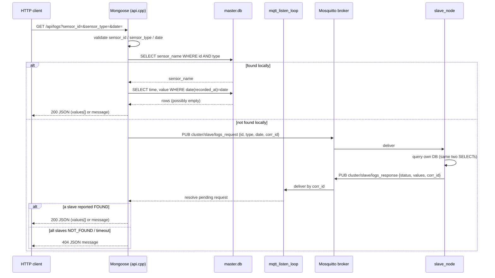
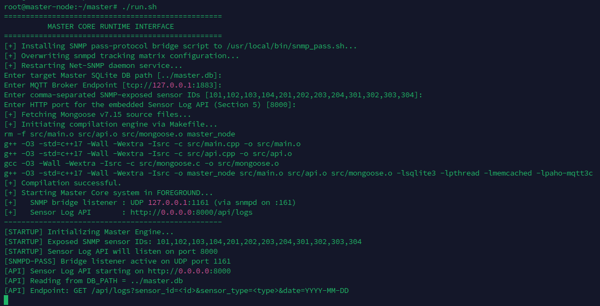
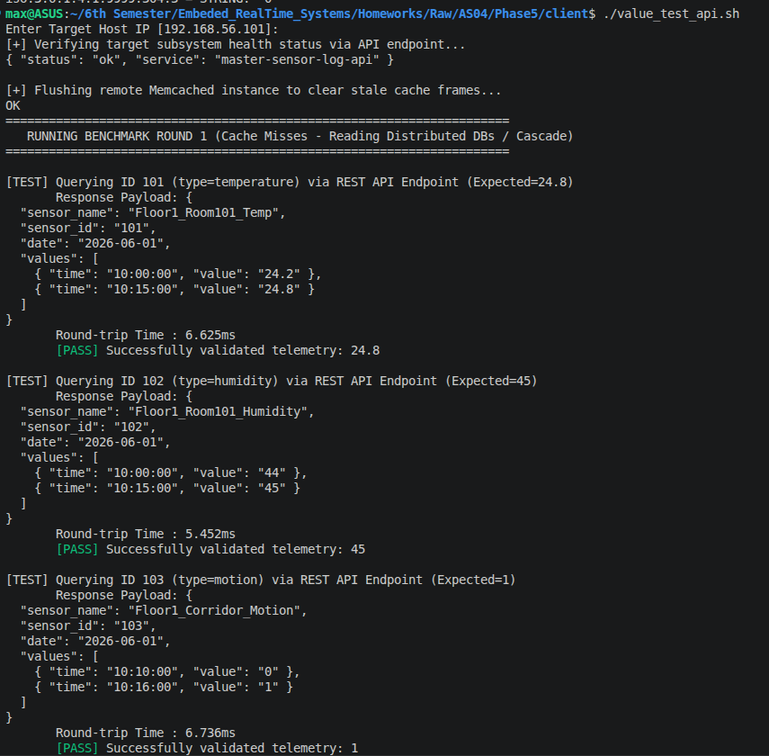

# Report — Section 5: API Development for Reading Sensor Logs

## 1. Overview

Section 5 adds a **read-only HTTP API** to the Master VM: a single
endpoint that answers *"show me everything sensor X recorded on date
Y"* — a multi-row, historical query, as opposed to the single
latest-value shape earlier sections expose. It is implemented with
**Mongoose**, a single-file embedded HTTP server, compiled directly
into `master_node` (`src/api.cpp`, alongside `src/main.cpp`) and
started as a third thread from `main()`. `master/run.sh` builds and
starts it automatically — there is no separate binary, service, or
manual step, and `Ctrl+C` on the Master stops it along with everything
else via the same shared `g_running` flag.

## 2. Why an embedded HTTP API, and why Mongoose

The assignment requires the API to be implemented in C/C++ using
Mongoose. Embedding it inside `master_node` rather than shipping a
second program was a design choice on top of that requirement: the
project's convention is that every component is driven entirely by its
own `run.sh` with nothing run manually outside of it, and the data this
endpoint reads (`sensors`, `sensor_readings`) already lives in the
same SQLite files `master_node` already opens — a second process would
either need its own DB handle (fine, SQLite handles concurrent
readers) or its own copy of the MQTT cluster-fallback logic (not fine
— duplicated state). A third thread inside the existing process avoids
both.

**Mongoose** was chosen (beyond being the assignment's required
library) because it's dependency-free and single-file: `run.sh` fetches
`mongoose.c`/`mongoose.h` with `wget` on first run exactly the way it
already installs system packages via `apt`, and caches them in `src/`
for subsequent runs — no package manager, no build system beyond the
project's existing `Makefile`.

## 3. Request structure

```
GET /api/logs?sensor_id=<id>&sensor_type=<type>&date=<YYYY-MM-DD>
```

| Parameter | Type | Required | Validation |
|---|---|---|---|
| `sensor_id` | string | yes | non-empty, numeric characters only |
| `sensor_type` | string | yes | non-empty, alphanumeric characters only |
| `date` | string | yes | must match `YYYY-MM-DD` |

All three are standard URL query parameters, parsed with Mongoose's
`mg_http_get_var()`. Each is validated — `sensor_id` numeric,
`sensor_type` alphanumeric, `date` against a strict regex — before
ever reaching a SQL query, rejecting malformed input early with a
`400`.

The lookup is keyed on **both** `sensor_id` and `sensor_type`
together — a row only matches if a sensor with that exact id has that
exact type. `sensor_name` is not a request input; it's resolved from
the DB and only echoed back in the response, since it's derived data
rather than something the caller needs to already know. `sensor_type`
was chosen as the disambiguating field instead, since it protects
against a `sensor_id` ever being reused for a different kind of
sensor — the lookup fails safely (treated as "not found") rather than
silently returning the wrong sensor's data. See the deviation note in
`README.md` Section 1 regarding the assignment's literal sample input.

## 4. Response structure

**4.1 Success (rows found)** — HTTP `200`:

```json
{
  "sensor_name": "Floor1_Room101_Temp",
  "sensor_id": "101",
  "date": "2026-06-01",
  "values": [
    { "time": "10:00:00", "value": "24.2" },
    { "time": "10:15:00", "value": "24.8" }
  ]
}
```

`values` is an array of `{time, value}` pairs, ordered chronologically
(ascending `recorded_at`), matching the sample output in the spec.

**4.2 No data for that date (sensor exists, nothing recorded)** — HTTP
`200`, since the request itself was well-formed and successfully
answered; the *answer* is "nothing recorded":

```json
{
  "sensor_name": "Floor1_Room101_Temp",
  "sensor_id": "101",
  "date": "2026-06-02",
  "values": [],
  "message": "No recorded values found for sensor 'Floor1_Room101_Temp' (id=101) on 2026-06-02."
}
```

**4.3 Unknown sensor** (wrong `sensor_id`, wrong `sensor_type`, or
genuinely not found anywhere in the cluster) — same shape as 4.2, but
the message states no sensor was found with that `sensor_id` +
`sensor_type` combination "anywhere in the cluster" — this fires only
after the Master's own DB *and* both Slaves (via the MQTT fallback,
Section 5) have all reported a miss. HTTP `404`.

**4.4 Bad input** — HTTP `400`:

```json
{ "error": "Invalid date. Expected format is YYYY-MM-DD." }
```

Distinct messages are returned for missing parameter(s), a
non-numeric `sensor_id`, a non-alphanumeric `sensor_type`, and a
malformed `date`.

**4.5 Server-side failure** — HTTP `500`, only if the SQLite file
itself can't be opened (e.g. `DB_PATH` misconfigured):

```json
{ "error": "Unable to open the sensor database on this node." }
```

All responses are pretty-printed JSON with `Content-Type:
application/json`, built manually (no JSON library dependency) with a
small escaping helper to keep quotes/backslashes/control characters
safe inside string values.

## 5. Data reading path

```
HTTP GET /api/logs?sensor_id=&sensor_type=&date=
        │
        ▼
Mongoose event loop, running on its own thread inside master_node
        │
        ▼
handle_logs_request()
   ├─ validate sensor_id / sensor_type / date
   ▼
query_sensor_logs(db_path, sensor_id, sensor_type, date)   -- LOCAL DB, this node only
   ├─ sqlite3_open_v2(DB_PATH, READONLY)
   ├─ SELECT sensor_name FROM sensors
   │      WHERE sensor_id = ? AND sensor_type = ?
   │      → confirms the sensor exists on THIS node, fetches its name
   ├─ SELECT time(recorded_at), value
   │    FROM sensor_readings
   │    WHERE sensor_id = ? AND date(recorded_at) = ?
   │    ORDER BY recorded_at ASC
   │      → every reading for that sensor on that calendar day
   │
   ├─ found here?  ──yes──▶ build_success_json() / build_message_json()
   │
   └─ not found on this node
        ▼
   fetch_logs_from_slaves_mqtt(sensor_id, sensor_type, date, corr_id)
   ├─ publish "cluster/slave/logs_request" {id, sensor_type, date, correlation_id}
   ├─ resolves the matching pending request when a slave replies FOUND
   │    on "cluster/slave/logs_response", or after a timeout elapses
   ▼
found on a slave?  ──yes──▶ parse_values_string() → build_success_json()
   │
   no ──▶ build_message_json() (404)
        │
        ▼
mg_http_reply() → JSON response back to the client
```



The database is opened **read-only** (`SQLITE_OPEN_READONLY`) on every
request — a deliberate simplicity/safety choice for a reporting
endpoint: the API can never write to or corrupt any node's database,
and no connection pooling or locking strategy is needed. The cluster
fallback reuses the Master's existing MQTT connection and
pending-request table rather than opening a second connection — a
second topic pair (`cluster/slave/logs_request` /
`cluster/slave/logs_response`) layered on the same request/wait/timeout
mechanism, but not routed through Memcached: a historical, date-scoped,
multi-row query doesn't fit the single-latest-value shape a value
cache is built for, so each slave reads its own SQLite directly for
every request instead.

## 6. Testing method

`client/value_test_api.sh` drives the whole test matrix in one run:

1. `GET /api/health` — confirms the API is up before running anything else.
2. For each of the twelve sensors in the cluster (four per node),
   `GET /api/logs?sensor_id=&sensor_type=&date=2026-06-01`, printing
   the round-trip time and checking the response against the expected
   value.
3. Because four of those twelve sensors live on the Master and eight
   live on the Slaves, the same run exercises both the local-DB path
   and the MQTT cluster-fallback path without any extra configuration.

Manually, the same cases can be driven with `curl` one at a time — see
`README.md` Section 4 and `master/README.md` for the exact commands
covering a local hit, a cluster-fallback hit, a sensor with no data for
the requested date, an unknown sensor, and malformed input.

## 7. Figures

Screenshots referenced below live in `figure/`. Captions marked
**(placeholder)** still need a screenshot captured and dropped into
that folder under the given filename before submission.

**Figure 1 — Master startup log**, showing `run.sh` fetching Mongoose,
compiling, and `master_node` reporting the Sensor Log API listening
alongside the rest of the engine.



**Figure 2 — `client/value_test_api.sh` benchmark run**, health check
followed by all twelve sensors queried through `GET /api/logs`, each
response payload printed and validated against its expected value.



**Figure 3 — Cluster fallback timing (placeholder).** A captured
comparison of a local hit (sensor on `master.db`, e.g. `101`) versus a
cluster fallback (sensor on a slave, e.g. `204`), showing the
round-trip time difference described in Section 5.
`figure/api_cluster_fallback_timing.png` *(not yet captured)*

**Figure 4 — Error responses (placeholder).** A captured `curl` run
showing the `400` (malformed input), `404` (unknown sensor), and
no-data-for-date (`200` with an empty `values` array) cases from
Section 4 side by side.
`figure/api_error_cases.png` *(not yet captured)*
