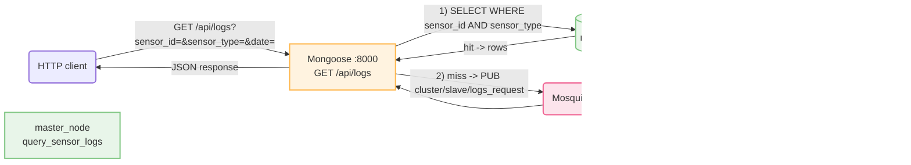

# `master/` — Section 5 Master Node

Quick-start for **this node only**. For the API design, request/response
schema, and data-path diagrams see [`../README.md`](../README.md) and
[`../Report.md`](../Report.md).

## What this node does

Runs `master_node` with one new thread added: an embedded **Mongoose**
HTTP server (`src/api.cpp`) answering:

```
GET /api/logs?sensor_id=<id>&sensor_type=<type>&date=<YYYY-MM-DD>
```

It checks this node's own `sensors`/`sensor_readings` tables first.
If the `sensor_id`/`sensor_type` pair isn't stored locally, it falls
back to a second MQTT topic pair — `cluster/slave/logs_request` /
`cluster/slave/logs_response` — so one call to the Master answers for
any sensor in the cluster. See `../Report.md` Section 5 for the full
request flow.



## Setup

```bash
cd master
./run.sh
# ...
# Enter HTTP port for the embedded Sensor Log API (Section 5) [8000]:
```

`run.sh` additionally:
1. Installs `wget` if missing.
2. Fetches `mongoose.c`/`mongoose.h` into `src/` on first run if not
   already vendored there (cached for later runs).
3. Prompts for the API port and writes `API_PORT=<port>` into `env`.
4. Compiles `src/main.cpp` + `src/api.cpp` + `src/mongoose.c` together
   into `master_node` via the `Makefile`.
5. Runs `master_node` in the foreground — this starts the API thread
   along with the rest of the engine.

```
[API] Sensor Log API starting on http://0.0.0.0:8000
[API] Reading from DB_PATH = ../master.db
[API] Endpoint: GET /api/logs?sensor_id=<id>&sensor_type=<type>&date=YYYY-MM-DD
```

See `../figure/master_output.png` for a captured run. Stop everything
with `Ctrl+C`.

## Files here

| File | Purpose |
|---|---|
| `src/api.cpp` | Section 5: the Mongoose HTTP handler — validation, `query_sensor_logs()`, JSON builders, MQTT slave fallback |
| `src/api.h` | Declares `run_api_server(db_path, port)`, launched from `main()` on its own thread |
| `src/cluster.h` | Lets `api.cpp` reuse `main.cpp`'s MQTT connection/pending-request machinery without duplicating it |
| `src/mongoose.c` / `src/mongoose.h` | Vendored by `run.sh` on first run (not checked into the repo) |
| `Makefile` | Extended to also compile `api.cpp` (g++) and `mongoose.c` (gcc) |
| `run.sh` | Extended to fetch Mongoose and prompt for `API_PORT` |
| `env` | Now also contains `API_PORT` |

## Testing the API

```bash
curl "http://192.168.56.101:8000/api/health"
# { "status": "ok", "service": "master-sensor-log-api" }

curl "http://192.168.56.101:8000/api/logs?sensor_id=101&sensor_type=temperature&date=2026-06-01"
# 200 — local hit (sensor 101 lives in master.db)

curl "http://192.168.56.101:8000/api/logs?sensor_id=204&sensor_type=co2&date=2026-06-01"
# 200 — cluster fallback (sensor 204 lives in slave1.db); expect tens
# of ms rather than single-digit ms, since it waits on a real MQTT
# round-trip instead of a local SQLite read

curl "http://192.168.56.101:8000/api/logs?sensor_id=101&sensor_type=temperature&date=2026-06-02"
# 200 — sensor exists, nothing recorded that day: empty "values" + "message"

curl "http://192.168.56.101:8000/api/logs?sensor_id=999&sensor_type=temperature&date=2026-06-01"
# 404 — unknown sensor_id, or a sensor_id/sensor_type mismatch

curl "http://192.168.56.101:8000/api/logs?sensor_id=abc&sensor_type=temperature&date=2026-06-01"
# 400 — malformed input (also fires for a missing param or bad date format)
```

See `../figure/client_api_test.png` for a captured run of
`client/value_test_api.sh` covering all twelve sensors, and
`../Report.md` Section 4 for every response shape in full.

## Stopping it

`Ctrl+C`/`SIGTERM` — stops the API's Mongoose event loop along with
the rest of `master_node`, via the same shared `g_running` flag.
