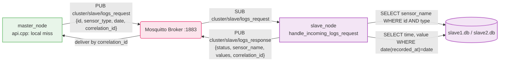

# `slave/` — Section 5 Slave Node

Quick-start for **this node only** — used identically for both Slave 1
and Slave 2, just pointed at a different DB file. For the full
picture see [`../README.md`](../README.md) and
[`../Report.md`](../Report.md).

## What this node does

Runs `slave_node` with one new handler added: `handle_incoming_logs_request()`,
subscribed on `cluster/slave/logs_request`. When the Master's HTTP API
can't find a `sensor_id`/`sensor_type` pair in its own `master.db`, it
publishes a historical, date-scoped query on that topic. Each slave,
on receipt:

1. Opens its **own** local SQLite DB read-only.
2. Looks up `sensor_name` by `sensor_id` + `sensor_type` (must match
   both).
3. If found, selects every `(time, value)` row in `sensor_readings`
   for that sensor on that calendar date, ordered chronologically.
4. Publishes the result back on `cluster/slave/logs_response`, tagged
   with the request's `correlation_id` — `FOUND` with the readings
   packed as `HH:MM:SS|value` pairs joined by `;`, or `NOT_FOUND` if
   the sensor doesn't exist here.

There is no HTTP server on this node — a slave has no idea an HTTP
request is the reason it's being asked for a sensor's logs; every
`logs_request` looks like ordinary MQTT traffic.



## Setup

```bash
cd slave
./run.sh
# Enter local SQLite database path [../slave1.db]: ../slave1.db   (or ../slave2.db)
# Enter Target MQTT Broker Endpoint [tcp://192.168.56.101:1883]: tcp://192.168.56.101:1883
```

`run.sh` is unchanged for this section — no new dependency was needed;
`handle_incoming_logs_request()` reuses the same `libsqlite3`/
`libpaho-mqtt3c` the node already links against.

Start this **after** the Master. Any sensor stored in this node's
local DB becomes reachable through the Master's HTTP API automatically
once `slave_node` is running — no configuration needed here. See
`../figure/slave1_output.png` / `../figure/slave2_output.png` for
captured runs.

## Files here

| File | Purpose |
|---|---|
| `src/main.cpp` | `slave_node` source — gained `handle_incoming_logs_request()`, subscribed to `cluster/slave/logs_request` |
| `Makefile` | unchanged |
| `run.sh` | unchanged |
| `env` | unchanged (`DB_PATH`, `MQTT_BROKER`) |

## Stopping it

`Ctrl+C`/`SIGTERM` — caught, disconnects from MQTT cleanly.
