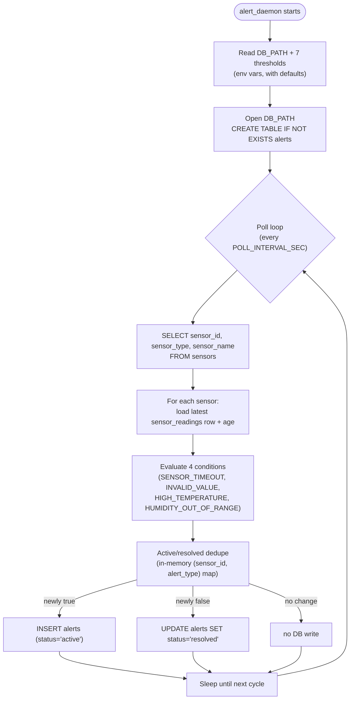

# Section 6 — Design and Implementation of the Alert System

A single standalone program, `alert_daemon`, that periodically checks
recorded sensor values and logs an alert the moment one of four
conditions is violated (and again when it clears). Unlike Section 5's
API, it isn't a thread embedded in another process — it's its own
binary, with its own `Makefile`, `run.sh`, and `systemd` unit, deployed
identically on every node in the cluster: each instance is pointed
(via `DB_PATH`) at that node's own local SQLite database, and never
looks at any other node's data.

```
Phase6/
├── alert_daemon/
│   ├── src/main.cpp          # poll loop, four alert conditions, active/resolved dedupe
│   ├── Makefile                builds alert_daemon (links libsqlite3 only)
│   ├── run.sh                  installs deps, prompts for config, compiles,
│   │                             installs + enables + starts the systemd service
│   ├── alert_daemon.service    systemd unit (reference copy; run.sh generates the real one)
│   ├── seed_alerts.sh          inserts sample alert rows for demo purposes
│   └── README.md                execution & usage guide (compile/install/run/stop/status/logs/query/conditions)
├── figure/                       screenshots
├── README.md                     this file
└── Report.md                     design report (functionality diagram, alert logic, storage structure)
```

> **Note on the proposed layout:** `alert_daemon/src/main.cpp` is the
> "Daemon code" deliverable; `alert_daemon/Makefile`, `run.sh`, and
> `alert_daemon.service` are the Makefile, install/execution script,
> and systemd service file deliverables; `seed_alerts.sh` is the "DB
> seeding script" deliverable, used purely for demoing/querying the
> `alerts` table without waiting on a real condition to occur — the
> daemon itself needs no seed data to function, since it creates the
> `alerts` table itself (`CREATE TABLE IF NOT EXISTS`) in whichever
> local DB `DB_PATH` points at.

## 1. Alert table structure

Exactly the schema given in the assignment, created automatically on
first run — no separate migration step:

```sql
CREATE TABLE IF NOT EXISTS alerts (
    id INTEGER PRIMARY KEY AUTOINCREMENT,
    sensor_id TEXT,
    sensor_name TEXT,
    alert_type TEXT,
    sensor_value TEXT,
    created_at TEXT,
    status TEXT
);
```

`status` is either `'active'` (condition currently violated) or
`'resolved'` (it cleared) — see `Report.md` Section 3 for how the
daemon decides when to insert a new row versus update an existing one.

## 2. Alert generation conditions

Evaluated once per sensor, every poll cycle:

| # | Alert type | Applies to | Condition (default threshold) |
|---|---|---|---|
| 1 | `HIGH_TEMPERATURE` | `sensor_type = 'temperature'` | latest value `> TEMP_HIGH_MAX` (`35.0`) |
| 2 | `HUMIDITY_OUT_OF_RANGE` | `sensor_type = 'humidity'` | latest value `< HUMIDITY_MIN` or `> HUMIDITY_MAX` (`20.0`–`70.0`) |
| 3 | `SENSOR_TIMEOUT` | every sensor | no reading at all, or the latest one older than `SENSOR_TIMEOUT_SEC` (`300`) |
| 4 | `INVALID_VALUE` | every sensor with a reading | value isn't a parseable number, or is numeric but outside `[VALUE_MIN, VALUE_MAX]` (`-50.0`–`1000.0`) |

All eight thresholds are `run.sh` prompts, written into `env`, with no
recompilation needed to change them. See `alert_daemon/README.md` item
8 for the precedence rules between conditions, and `Report.md` Section
4 for the full rationale.

## 3. How to compile, install, and run

```bash
cd alert_daemon
./run.sh
```

One command, run once per node, does everything: installs
`libsqlite3-dev`, prompts for `DB_PATH` and the eight thresholds
above, compiles via the `Makefile`, generates
`/etc/systemd/system/alert_daemon.service` with this checkout's real
path filled in, then `daemon-reload`s, `enable`s, and `restart`s the
service. See `figure/master_output.png` for a captured run.

Full detail — including how to stop it, check its status, read its
logs, and query the `alerts` table directly — is in
`alert_daemon/README.md`, laid out as the 8-item checklist the
assignment asks for.

## 4. Daemon functionality overview



See `Report.md` Section 5 for the fully detailed version of this
diagram (env vars, signal handling, per-condition branches) and
Section 3 for the dedupe strategy's tradeoffs.
