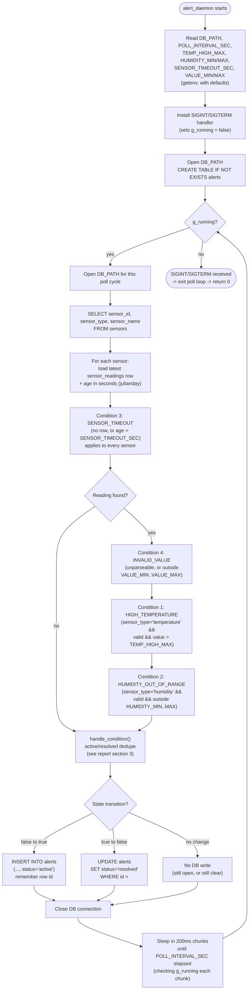
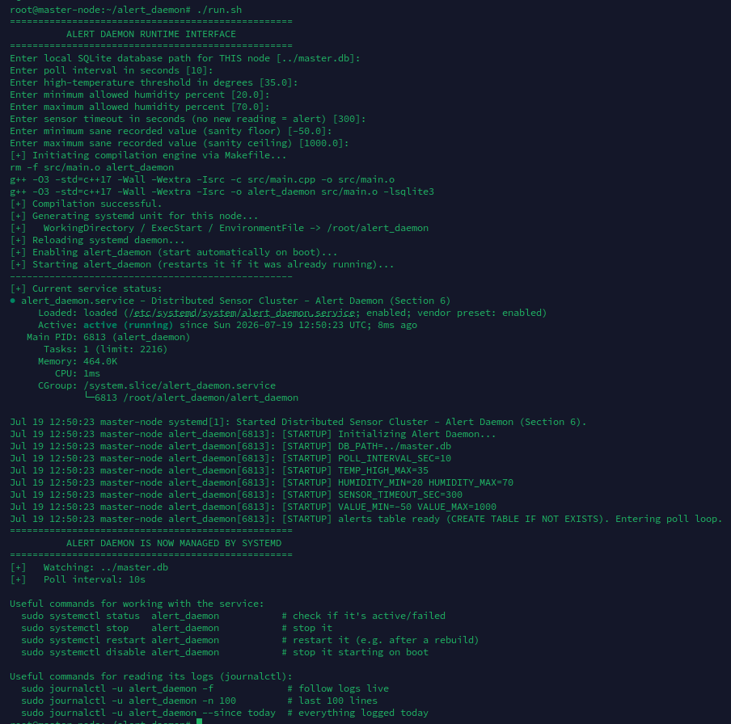
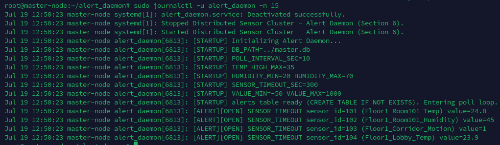
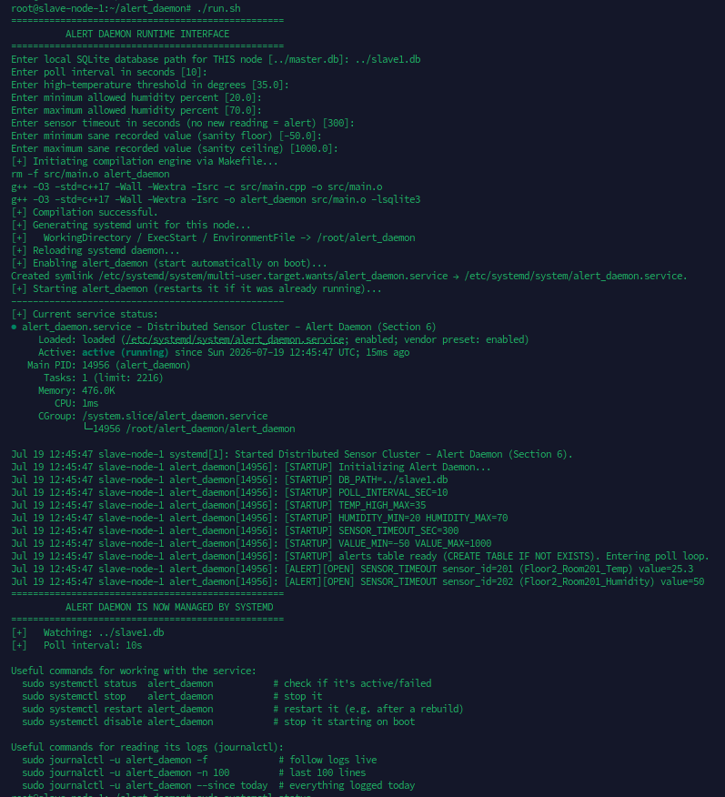
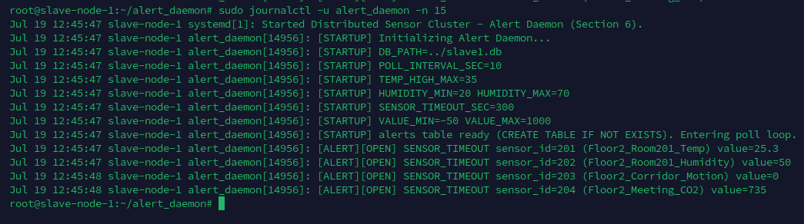
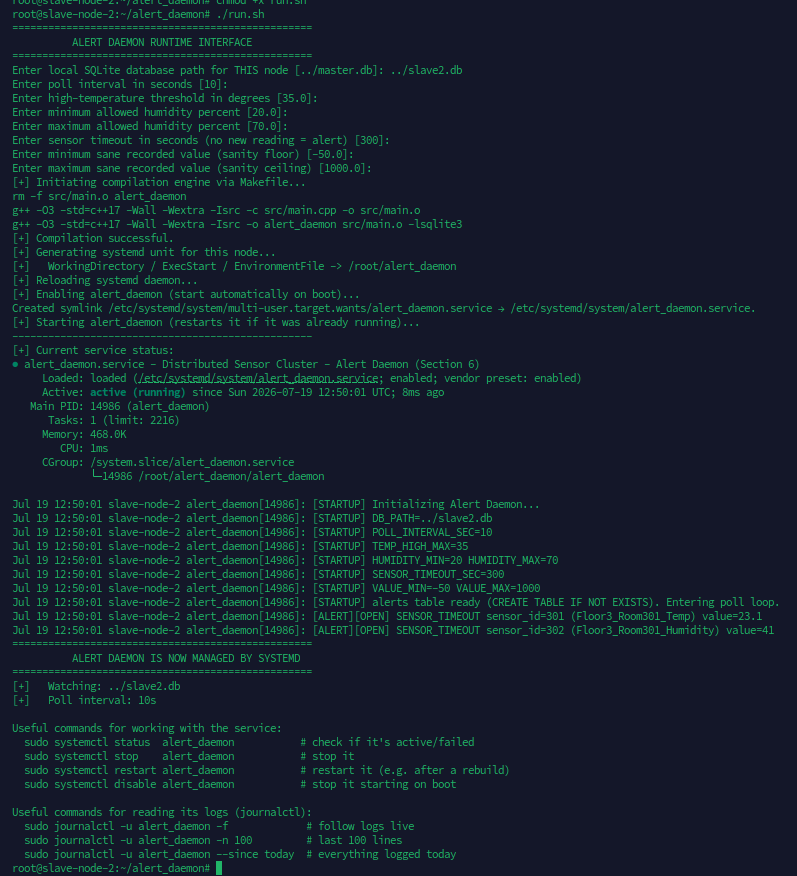
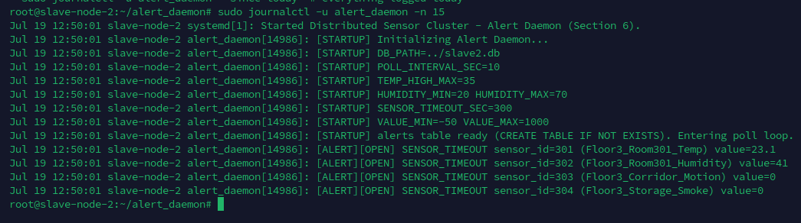
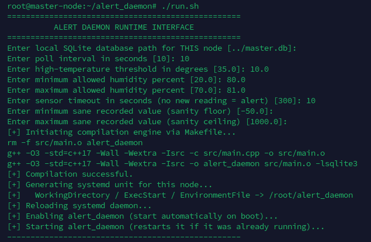
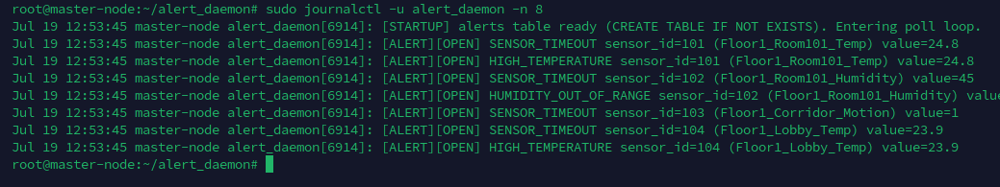

# Report — Section 6: Design and Implementation of the Alert System

## 1. Purpose

Phases 1-5 read and serve sensor data (latest value over SNMP, history
over HTTP) but never react to it. Section 6 adds a watchdog: a daemon
that periodically inspects each node's own recorded sensor values and
logs an `alerts` row the moment one of four conditions is violated
(and again when it clears), directly in that node's own SQLite DB.

## 2. Why it's a separate standalone binary

`alert_daemon` is **the same program deployed on every node** —
master, slave1, slave2 — each instance monitoring only its own local
`sensors`/`sensor_readings`. A single standalone binary, built once and
run identically everywhere via its own `run.sh`/`Makefile`/`systemd`
unit (each node just pointing `DB_PATH` at its own DB), is the natural
fit for that — and it matches the assignment's framing of "a Daemon,"
singular, for the whole system, rather than requiring per-node
customization.

Consequently it has none of the other nodes' dependencies: no
Memcached, no MQTT/Paho, no Mongoose. It links against `libsqlite3`
only.

Cross-node/aggregated alerting (e.g. one node raising an alert about
another node's sensor, or a "cluster health" view) is explicitly out
of scope — each instance never looks outside its own `DB_PATH`.

## 3. Alert table structure and dedupe strategy

Schema (created with `CREATE TABLE IF NOT EXISTS` on daemon startup,
in whichever local DB `DB_PATH` points at — no separate alerts
database, no seeding required for the daemon to function):

```sql
CREATE TABLE IF NOT EXISTS alerts (
    id INTEGER PRIMARY KEY AUTOINCREMENT,
    sensor_id TEXT,
    sensor_name TEXT,
    alert_type TEXT,
    sensor_value TEXT,
    created_at TEXT,
    status TEXT
);
```

This is the exact structure given in the assignment — no columns were
added or removed. In particular, there's no separate `resolved_at`
column: since the schema is fixed, the daemon represents a resolved
alert by updating that same row's existing `status` field from
`'active'` to `'resolved'` in place, rather than by adding state
elsewhere.

**Dedupe strategy: active/resolved transition tracking, not one row
per poll cycle.** This was an explicit choice between two options:

- *(rejected)* **One row per poll cycle**: simplest to implement
  (every poll, for every condition still true, insert a row) but for a
  `POLL_INTERVAL_SEC=10` default, a temperature staying high for an
  hour would write 360 near-identical rows. The table stops being a
  log of distinct problems and becomes a log of poll ticks; "how many
  things are wrong right now" requires collapsing duplicates in a
  query.
- *(chosen)* **Active/resolved state tracking**: the daemon keeps an
  in-memory map, keyed by `(sensor_id, alert_type)`, of the
  `alerts.id` of any currently-open (`status='active'`) row for that
  pair.
  - condition becomes true and wasn't already open → **insert** one
    new `'active'` row, remember its id.
  - condition stays true → do nothing (this is the dedupe).
  - condition becomes false and was open → **update** that row's
    `status` to `'resolved'`, forget it.
  - condition stays false → do nothing.

  Tradeoff: `alerts` now reads as an incident log — one row per
  violation *episode* from onset to clearance — and `SELECT * FROM
  alerts WHERE status='active'` is a direct, correct answer to "what's
  wrong right now," with no de-duplication needed at query time. The
  cost is twofold: (1) the table no longer records *how long* or *how
  many poll cycles* a violation persisted — only its start
  (`created_at`) and, implicitly, whatever poll cycle happened to
  notice it clear; (2) the open/closed bookkeeping is **in-memory
  only** (`std::unordered_map` in the daemon process). A daemon
  restart starts that map empty, so if a condition is still actively
  violated at restart time, the next poll sees it as "not currently
  tracked as open" and logs a brand-new `'active'` row for it — it
  does not recognize the still-open row already sitting in `alerts`
  from before the restart, since no startup reconciliation pass (e.g.
  `SELECT id FROM alerts WHERE status='active'` to repopulate the
  in-memory map) was implemented. This is a deliberate simplicity
  tradeoff for this assignment, documented here rather than silently
  left as a bug.

## 4. Alert generation logic, per condition

All four conditions are evaluated once per sensor per poll cycle,
inside `evaluate_sensor()`:

**1. High temperature** — `sensor_type = 'temperature'` and the latest
reading, parsed as a number, is `> TEMP_HIGH_MAX` (default `35.0`).
Skipped entirely for non-temperature sensors.

**2. Humidity out of range** — `sensor_type = 'humidity'` and the
latest reading is `< HUMIDITY_MIN` or `> HUMIDITY_MAX` (defaults
`20.0` / `70.0`). Skipped for non-humidity sensors.

**3. Sensor timeout** — applies to *every* sensor regardless of type.
True if `sensor_readings` has no row at all for that `sensor_id`, or
if the newest one is older than `SENSOR_TIMEOUT_SEC` (default `300`)
seconds. The age is computed inside the SQL query itself
(`julianday('now') - julianday(recorded_at)`, scaled to seconds)
rather than parsed in C++, since `recorded_at` is already known to be
in a format SQLite's date/time functions understand.

**4. Invalid recorded value** — applies to every sensor that *has* a
reading. True if the value fails a strict numeric parse (`strtod`,
whole string must be consumed) or if it parses fine but falls outside
a generic sanity range `[VALUE_MIN, VALUE_MAX]` (defaults `-50.0` /
`1000.0`) that no legitimate sensor reading in this cluster should
ever fall outside of, regardless of type.

**Precedence**: condition 4 (invalid value) is evaluated first, and
conditions 1/2 are gated on the value being valid (`numeric &&
!invalid`) before being checked against their thresholds. Rationale:
if a reading is already flagged as garbage — unparseable, or wildly
out of any plausible range — the daemon should not simultaneously
assert that it *confirms* a real high-temperature or bad-humidity
event. A single malformed reading produces one `INVALID_VALUE` alert,
not an `INVALID_VALUE` alert plus a spurious
`HIGH_TEMPERATURE`/`HUMIDITY_OUT_OF_RANGE` alert riding on the same
bad data point.

## 5. Daemon functionality diagram



## 6. Testing method

Two ways the daemon was exercised, both captured in Section 8's
figures:

1. **Default thresholds** (`TEMP_HIGH_MAX=35`, `HUMIDITY_MIN/MAX=20/70`,
   `SENSOR_TIMEOUT_SEC=300`) — realistic values, so on a freshly seeded
   cluster the only condition likely to fire quickly is
   `SENSOR_TIMEOUT` (no reading has been written recently enough).
2. **Deliberately tightened thresholds** (e.g.
   `TEMP_HIGH_MAX=10`, `HUMIDITY_MIN/MAX=80/81`,
   `SENSOR_TIMEOUT_SEC=10`) — set low enough on purpose that every
   sensor's existing sample data immediately violates at least one
   condition, so all four alert types can be observed firing within
   one poll cycle without waiting on real-world conditions to occur.

Both runs are driven the same way — `./run.sh`, answering the
threshold prompts — and observed with `sudo systemctl status
alert_daemon` and `sudo journalctl -u alert_daemon`. `seed_alerts.sh`
additionally inserts a handful of sample `alerts` rows directly, for
demoing the query step (`alert_daemon/README.md` item 7) without
depending on either run above having fired yet.

## 7. Figures

Screenshots referenced below live in `figure/`. Captions marked
**(placeholder)** still need a screenshot captured and dropped into
that folder under the given filename before submission.

**Figure 1 — Master: `run.sh` with default thresholds**, showing
compilation, systemd unit generation/install, and the resulting
`systemctl status` output.



**Figure 2 — Master: `journalctl` under default thresholds**, showing
`SENSOR_TIMEOUT` alerts opening for sensors with no recent reading.



**Figure 3 — Slave 1: `run.sh` output.**



**Figure 4 — Slave 1: `journalctl` output.**



**Figure 5 — Slave 2: `run.sh` output.**



**Figure 6 — Slave 2: `journalctl` output.**



**Figure 7 — Master: `run.sh` with deliberately tightened thresholds**
(`TEMP_HIGH_MAX=10`, `HUMIDITY_MIN/MAX=80/81`,
`SENSOR_TIMEOUT_SEC=10`), forcing every condition to be reachable
within one poll cycle for demo purposes.



**Figure 8 — Master: `journalctl` with tightened thresholds**, showing
`SENSOR_TIMEOUT`, `HIGH_TEMPERATURE`, and `HUMIDITY_OUT_OF_RANGE`
alerts all opening within the same poll cycle.



**Figure 9 — `alerts` table contents via `sqlite3` (placeholder).** A
captured `SELECT id, sensor_id, sensor_name, alert_type, sensor_value,
created_at, status FROM alerts ORDER BY id DESC LIMIT 20;` showing a
mix of `active` and `resolved` rows, and a second query filtered to
`WHERE status='active'`.
`figure/alerts_table_query.png` *(not yet captured)*
