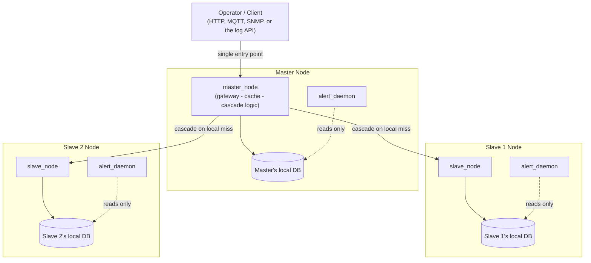

<p align="center">
  <br/>
  <sub><code>MaximumAsp66915/Embeded-RealTime-Systems</code> — branch <code>Distributed-Database-System</code></sub>
</p>

[](https://github.com/MaximumAsp66915/Embeded-RealTime-Systems/tree/Distributed-Database-System)

---

# Distributed Database System — Embedded Real-Time Systems Project

This repository implements a **distributed sensor-data cluster** — one **Master**
node and two **Slave** nodes, each backed by its own local SQLite database —
built up incrementally, phase by phase, into a full embedded/real-time
distributed system: an HTTP gateway, a caching layer, MQTT-based
inter-node communication, an SNMP monitoring agent, a read-only logging
API, and finally a standalone alert daemon.

Every phase is self-contained (its own `README.md` and `Report.md`) and
builds directly on top of the phase before it. This top-level document
ties all six phases together: the overall file layout, the simplified
end-to-end architecture, a few cross-cutting implementation notes, and
an index of every phase's own documentation.

## Project file hierarchy

```
Embeded-RealTime-Systems/  (Distributed-Database-System)
├── README.md                  # you are here — top-level overview + index
├── Report.md                  # top-level research write-up + index of phase reports
│
├── Phase1/                    # Section 1 — Basic distributed DB design (HTTP + NGINX)
│   ├── master/                #   master_node: HTTP gateway, local DB, cascades to slaves
│   ├── slave/                 #   slave_node:  HTTP endpoint over its own local DB
│   ├── client_tests/          #   curl-based end-to-end regression tests
│   ├── figure/                #   diagrams & screenshots referenced in Report.md
│   ├── README.md              #   quick-start: install, compile, run, query
│   └── Report.md              #   design write-up, DB structure, security review
│
├── Phase2/                    # Section 2 — Caching layer (Memcached) in front of SQLite
│   ├── master/  slave/        #   same roles as Phase1, now cache-first
│   ├── client_tests/          #   correctness + cache-hit/miss speed benchmarks
│   └── figure/  README.md  Report.md
│
├── Phase3/                    # Section 3 — Transport moves from HTTP to MQTT
│   ├── master/  slave/        #   MQTT clients of a single Mosquitto broker on the Master
│   └── client_tests/  latex/fig/  README.md  Report.md
│
├── Phase4/                    # Section 4 — SNMP read-only monitoring agent
│   ├── master/                #   adds an SNMP `pass`-script bridge alongside MQTT
│   ├── slave/                 #   unchanged from Phase3
│   └── client_tests/  figure/  README.md  Report.md
│
├── Phase5/                    # Section 5 — Read-only HTTP API (Mongoose) for sensor logs
│   ├── master/                #   API thread added inside master_node (src/api.cpp)
│   └── slave/  client/  figure/  README.md  Report.md
│
└── Phase6/                    # Section 6 — Standalone alert daemon
    ├── alert_daemon/          #   independent binary, deployed on every node
    └── figure/  README.md  Report.md
```

> Only each phase's own `README.md` / `Report.md` are treated as
> authoritative documentation here — this top-level document summarizes
> and links to them rather than duplicating their contents. Refer to a
> phase's own files for exact commands, environment variables, and
> configuration details.

## Simplified system overview

The diagram below intentionally omits per-phase detail (NGINX port
mapping, Memcached, MQTT topic names, SNMP OIDs, API routes) — see each
phase's own `Report.md` for that. At the level the whole project is
aiming for, the system is simply: **one Master, two Slaves, each with
its own local database, all reachable through the Master, with a
lightweight monitoring/alerting layer running alongside on every node.**



The operator always talks to the **Master only**; the Master answers
from its own database when it can, and transparently cascades the
lookup to whichever Slave can when it can't. Each `alert_daemon`
instance runs independently on its own node and only ever reads that
node's own local database — it has no cross-node knowledge.

## Implementation notes

A few conventions worth keeping in mind across every phase, mainly to
keep local testing painless:

- **Keep each node's DB file *next to* its folder, not inside it.**
  For example, if you're working out of `Phase1/master/`, point
  `DB_PATH` at `../master.db` rather than `Phase1/master/master.db`.
  This keeps the database out of the source tree (so `make clean`,
  `git status`, and re-cloning never touch it), and makes it trivial to
  run Master and Slave binaries side by side against clearly separate
  files during local testing, without one node's rebuild ever risking
  another node's data.
- **Every node is configured via environment variables, never
  hard-coded values** (`PORT`, `DB_PATH`, `MQTT_BROKER`, etc.) — each
  phase's `run.sh` prompts for these and writes them to a local `env`
  file purely for reference, so the same binary can be pointed at any
  role (Master, Slave 1, Slave 2) without touching source code.
- **Each phase is additive, not a replacement.** Phase 2's cache sits in
  front of Phase 1's database; Phase 4's SNMP agent and Phase 5's API
  both sit alongside Phase 3's MQTT transport; Phase 6's alert daemon is
  the only fully standalone piece, deployed identically on every node.
  When in doubt about what changed between two phases, that phase's
  `README.md` opens with a short summary of the diff against the phase
  before it.
- **Treat `client_tests/` (or `client/`) as the source of truth for
  "is this phase actually working."** Each one is a self-contained
  script that exercises the node(s) end-to-end, and is the fastest way
  to sanity-check a fresh setup before digging into the code.

## Phase documentation index

Each phase's own `README.md` is the authoritative quick-start for that
phase (dependencies, compilation, execution, and how to query it). This
list is kept in sync as each phase's documentation is updated:

- [Phase 1 — Basic Design of a Distributed Database System](Phase1/README.md)
- [Phase 2 — Caching and Two-Layer Database Structure](Phase2/README.md)
- [Phase 3 — System Connection to the MQTT Protocol](Phase3/README.md)
- [Phase 4 — Reading Sensor Information using the SNMP Protocol](Phase4/README.md)
- [Phase 5 — API Development for Reading Sensor Logs](Phase5/README.md)
- [Phase 6 — Design and Implementation of the Alert System](Phase6/README.md)

For the design rationale, diagrams, and analysis behind each phase, see
[`Report.md`](Report.md), which links to every phase's own report in
the same way.
